***

1. This assignment is my/our own original work, except where I/we have appropriately cited the original source (appropriate citation of original work will vary from discipline to discipline).
2. This assignment has not previously been submitted in any form for this or any other unit, degree or diploma at any university or other institute of tertiary education.
3. I/we acknowledge that it is my responsibility to check that the file I/we have submitted is: a) readable, b) the correct file and c) fully complete.

***

##__Introduction__

The data that we're analyzing consists of near infrared spectra measurements for different samples of diesel fuels. These measurements have been obtained by firing a spectrometer at a substance and recording the absorbance at a range of different frequencies (wavelengths). In our case we've been given measurements from 950nm - 1398nm, in increments of 2nm throughout this range - these values of absorption at each specific wavelength are the explanatory variables we have to work with. Each set of observations is paired with (in our case) a measurement of the substance's aromaticity - the mass percentage of total aromatic compounds found within the substance.

*But **what** are aromatic compounds, and **why** might it be useful to predict the amount of them within a sample of diesel fuel?*

Aromatic compounds are a special type of compound which due to their cyclic structure exhibit strong, very stable properties when compared compounds with the same atoms but a different arrangement. Specific types of aromatic compounds are useful in industry for example, the manufacturing process of polymers such as polyester and nylon rely almost entirely on aromatic hydrocarbons which are extracted during the process of refining oil. 

However, in the context of diesel fuels (the data we're working with in this project) aromatic compounds are actually considered **impurities**. The stability of aromatics means that they aren't easily converted to more desirable compounds. This causes accumulation problems in most processes where substances have a high aromatic content. 

More specifically, aromatics don't react or burn in the same way as the bulk of the fuel. Although this doesn't have a great effect on fuel combustion (the heat produced from the mass burned), it does have a great effect on soot (particulate) produced. The production/accumulation of this can not just lead to severe health consequences for the health of your diesel powered process (an engine perhaps), but can also have severe health consequences for humans if handled incorrectly. 

In general, the high stability (and therefore low reactivity) of aromatic compounds prevents them from burning as quickly or as completely in diesel fuels. This means that in a diesel fuel production setting, the goal would be to minimize the aromaticity in an effort to increase the overall quality of the fuel they would be producing. Thus, the models we set out to create, if demonstrated to be viable, could prove useful in predicting aromaticity - contributing to the overall quality (and as a result profitability) of a diesel fuel production company.

***

## __Exploratory Analysis__

```{r}
# loading in the data

load("S2_2017_STAT1000_ProjectData.RData")
```

```{r}
# attaching our explanatory variable to all the explanatory variables

AromSpectra <- cbind(Arom, ASpectra)
#head(AromSpectra)
```

```{r}
# renaming the index as they're out of order (due to prior cleaning); this is useful for finding outliers when we come to that

rownames(AromSpectra) <- 1:nrow(AromSpectra)
rownames(ASpectra) <- 1:nrow(ASpectra)
```


The first step in our exploratory analysis was to simply just *look* at the data we have. With 226 variables and 395 observations it's quite a lot of data to just simply visualize. We started off simply by trying to visualize just our response variable (aromaticity). And as you can see there's not a lot of observations with less than 20% aromatic compounds and literally no observations with more than 50% aromatic compounds; with the majority of observations having around 30%. This may just be a common feature within diesel fuels however, we definitely have limitations if the models we create from this data are used to predict aromaticity upwards of 50% - this should be factored into our conclusion.

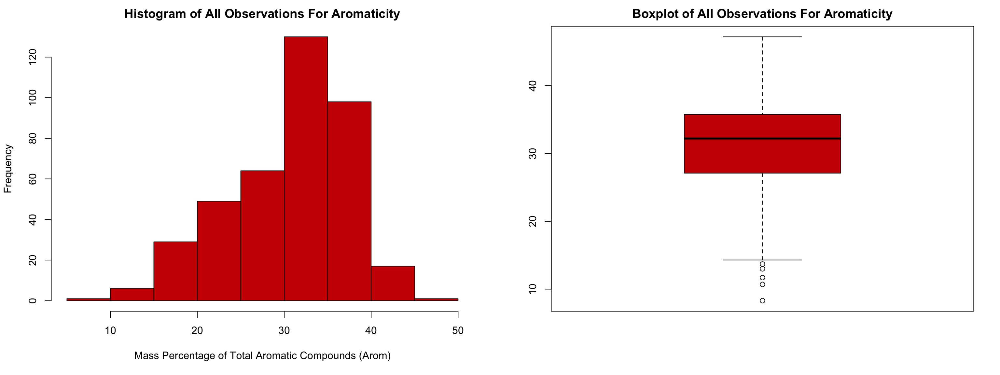

After having a quick look into our response variable (aromaticity), we wanted to have an overall glance at the *many* explanatory variables we have to work with, and how they might interact with one another. A quick way of doing can be seen in the following figure; a colour correlation plot.

Due to it being a 225 by 225 matrix, it's quite a busy figure. However, at a glance it is clear that the majority of explanatory variables have pretty strong, positive correlations to one another (visual indicator being the big blue masses). This means that for a lot of the explanatory variables, when one of them starts to increase the others will follow a similar trend. As a result our data has a lot of **redundancy** which will, for the most part, add unnecessary complexity to the models we create if we're not careful about explanatory variable selection.


Our next attempt at visualizing our data was to plot all the observations we have for near-infrared absorption (all observations of our explanatory variables), so in the following figure each line represents a row (set of observations) from within our dataset. From a glance it's obvious that there's at least a couple outlying sets of observations however, it's almost impossible to tell which lines are actually unique as they move in and out of the 'big red mass' where most of the observations exist.

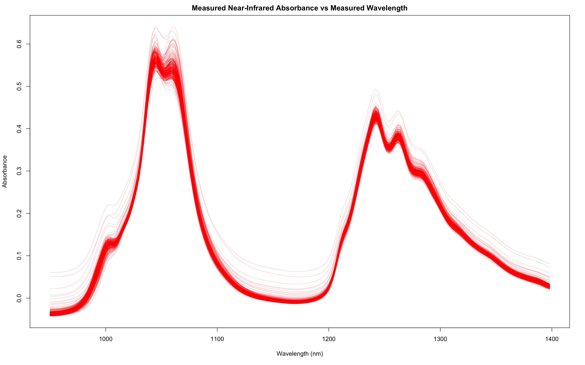

Although this figure was useful at a glance, it is quite 'busy' due to the shear number of observations which are pretty close to identical. In an effort to combat this we next created a figure which for each measured wavelength (each x-variable/column in our dataset) we calculated the maximum value, the average value, and the minimum value; and then just plotted those values instead. This more clearly shows that there's not *that* big of a difference between the average values and the minimum values **however**, there is *quite* a large difference between the average values and the maximum values - due to those 'couple' sets of observations seen in the previous figure.

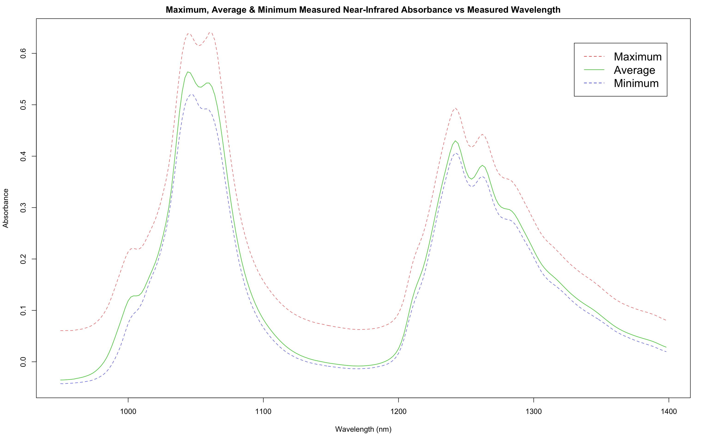

Thus, it's clear that some outlying observations **definitely do exist**, and they are all either *the* maximum observation for their measured wavelength or very close by to that outlying observation. However, we need to find a way of identifying these clear outliers; and since they're all very close to the maximum value it seems like that would be a simple way to go about identifying them.

What this chunk is doing is going through each measured wavelength (column in our dataset), and it's finding which set of observations (index/row number) that maximum value **in that column** belongs to. It then does the exact same thing except it will calculated the **second largest** value for that wavelength; and then it does the exact same thing but for the **third largest**.. We've then combined all the unique observations and found which observations are unique **within that combined set**. This is the 'Combined & Unique' output that we're left with; which in essence is a handful of observations which are, or are close to, that maximum line in the previous figure - potential outliers.

```{r}
# FINDING THE OUTLIERS

# this function calculates the max value if N = 1, the second largest number if N = 2, the third largest number if N = 3; etc, etc
# what I've done is used this to find the index of the 1st, 2nd and 3rd largest observations for each tested wavelength (all columns)

maxN <- function(x, N=2){
  len <- length(x)
  if(N>len){
    warning('N greater than length(x).  Setting N=length(x)')
    N <- length(x)
  }
  sort(x,partial=len-N+1)[len-N+1]
}

# 1st largest (just used which.max)
max_index <- c()
for (i in 1:225) max_index[i] <- which.max(ASpectra[,i])
sort(unique(max_index))

# 2nd largest
max_index2 <- c()
for (i in 1:225) max_index2[i] <- which(ASpectra[,i] == maxN(ASpectra[,i], 2))
sort(unique(max_index2))

# 3rd largest
max_index3 <- c()
for (i in 1:225) max_index3[i] <- which(ASpectra[,i] == maxN(ASpectra[,i], 3))
sort(unique(max_index3))

# combining them all together and finding the unique values
sort(unique(c(max_index, max_index2, max_index3)))

# rows/observations: 2, 4, 6, 99, 145, 306, 314, 350, 370
# are all candidates for being outlying observations, with 4, 306 and 314 (and sort of 99) being more 'significant'
```

Now that we have a handful of observations that are candidate outliers we need to determine if we actually should consider them outliers and remove them. To do this we put side by side our original maximum, average and minimum figure with all the observations; next to the same figure but with all of these 'candidate outliers' we found having been removed. And as you might notice, the difference between the maximum curve between the plots is quite significant. With the all these candidate outliers being removed the maximum curve is much closer to the average curve.

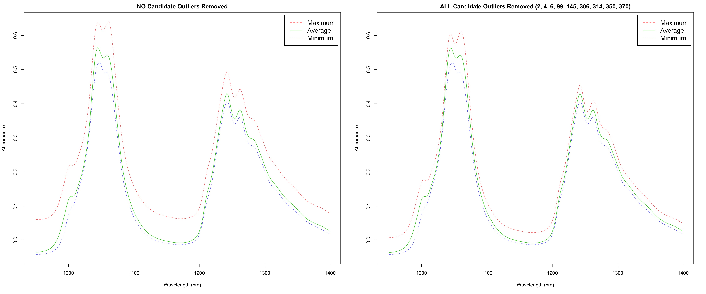

However, removing every single one of these candidate outliers seemed to be quite extreme; and is borderline 'cherry picking' our dataset. Instead of removing **all** these outliers we instead wanted to look at just removing the four *obvious* outliers which showed up in the largest and second largest sets. In an effort to do this we put these same figures side by side; except the left has only the four *obvious* outliers removed and the right has all outliers removed.

The figures side by side almost look identical; the only subtle difference being within a couple of the peaks. Thus, it seems like we'd lose more by removing **all** of these outliers so instead we should opt to only remove the **obvious** outliers (observations 4, 99, 306 and 314).

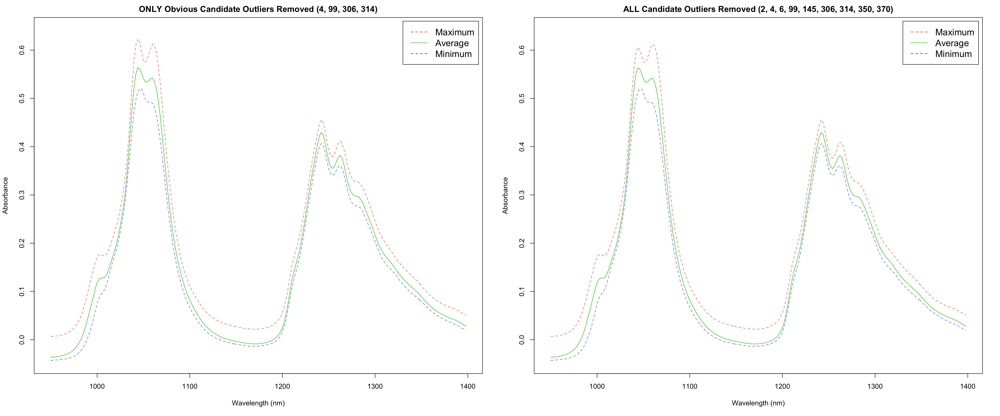

However, before we removed these observations it seemed like double checking them individually against the average set of observations would be a good idea. And they all look like prime candidates as outliers. Observations 4, 99 and 306 all start completely above the average; and from a glance look to be those few obvious outliers that could be seen in the first plot of all our explanatory observations. Observation 314 seems to be a lot closer to the mean for the most part, however it has *huge* peak which is completely unlike the average.

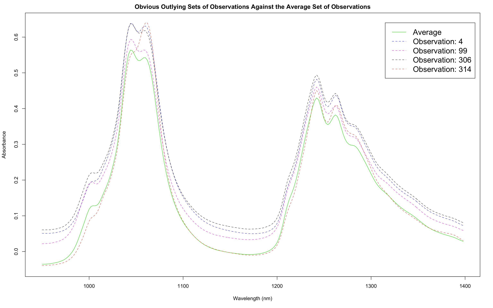

From the above exploratory analysis I think we've justified the removal of these four observations on the grounds that they're outliers, and will be more likely to skew our predictions (increase our bias) rather than explain variation within the data. We think that these observations could perhaps be due to a miscalibrated instrument when measuring the near-infrared absorption, or they could be due contaminants within the tested diesel fuel. Whatever the case, we believe they're outliers and are therefore removing them from our data set going forward in an effort to improve the accuracy of any further analysis.

```{r}
# from this EDA I think it makes sense and we're justified in removing observations (rows) 4, 99, 306 and 314 from our dataset

AromSpectra.out <- AromSpectra[-c(4, 99, 306, 314),]
ASpectra.out <- ASpectra[-c(4, 99, 306, 314)]
```

And now that these outlying observations have been removed we can finally create our training and test set and move onto creating some models from this data!

```{r}
# making the test set (randomly chosen 20%), and the training set (the remaining 80%)

set.seed(05011998)
test.index <- sample(nrow(AromSpectra.out), (floor(0.2*nrow(AromSpectra.out))))
AromSpectra.test <- AromSpectra.out[test.index,]
AromSpectra.train <- AromSpectra.out[-test.index,]
```

***

## __Simple Linear Regression__

Before starting to create and diagnose our simple linear regression model we have to first decide which variable we should be modelling out of the 225 we have to choose from. Instead of individually going through and fitting each variable and choosing the one which explains the most variation (lowest RSS); we instead used the results from the brute force and forward/backward variable selection methods to guide our decision. Both of these methods (unsurprisingly) came to the same conclusion that the variable 'X996' (the NIR absorption measurements taken at 996nm) are the 'most significant' with respect to our response variable, aromaticity.

```{r}
# the SLM with the variable that forward selection AND brute force all subsets deemed to be the 'most significant'

model.slm <- lm(Arom ~ X996, data = AromSpectra.train)
#summary(model.slm)
```

After fitting the model we needed to make sure that all the assumptions had been satisfied, that is we had to go through the diagnosis process. The first check was making sure that the standardised residuals were roughly normal. As seen from the histogram they do in fact look *roughly* normal however they are quite left skewed, especially due to the few observations falling outside of the third standard deviation.

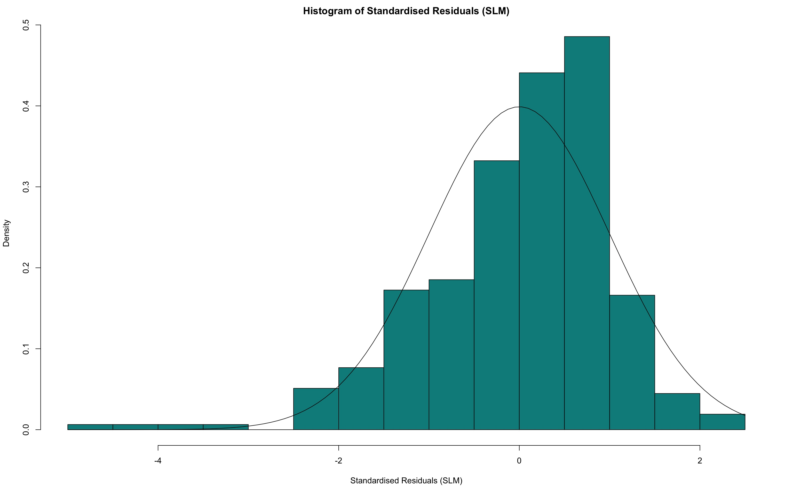

Instead of just a simple histogram we opted to next plot our standardised residuals against the actual values for absorbance at 996nm (the values of our x-variable). This meant that we could not only more clearly see the spread of our data, but we could also utilize the indentify() function to figure out which of our points are *quite far* away from the bulk of the residuals. 

From this figure we can also assess the consistency of the variance within our residuals; as for the model to provide accurate prediction/inference they must be constant. Ignoring the outliers we can see that data is quite evenly spread, there's no really obvious curvature within suggesting that transforming our data might prove quite useless. 

*As a side note though, we did go ahead and fit the same model but with log, sqrt and cubed-root however we saw no real improvements in the scatter so for the sake of simplicity we kept it as is.*

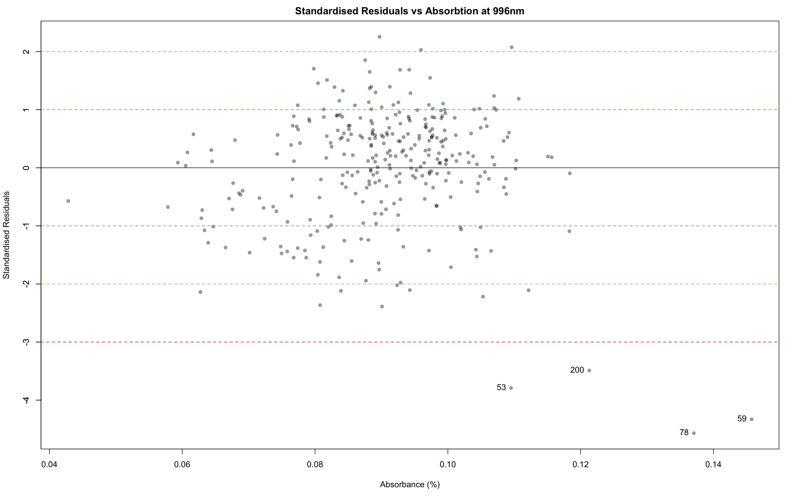

However, these points having larger than average standardised residuals isn't actually enough to prove that they're influential points, to infer whether a point has high influence we must also factor in it's *horizontal distance from the regression line*. One method of factoring this measure in, and therefore being able to make inference about a observation's leverage is Cooks' Distance.

In the following figure we can see that we have a handful of points which exceed the cut-off point we've drawn. However, when looking at a plot of Cooks' Distance the **distance between points** is more telling then just being above this cut-off point, and as a result any points below observation 53 are probably not high enough in leverage for us to justify removing.

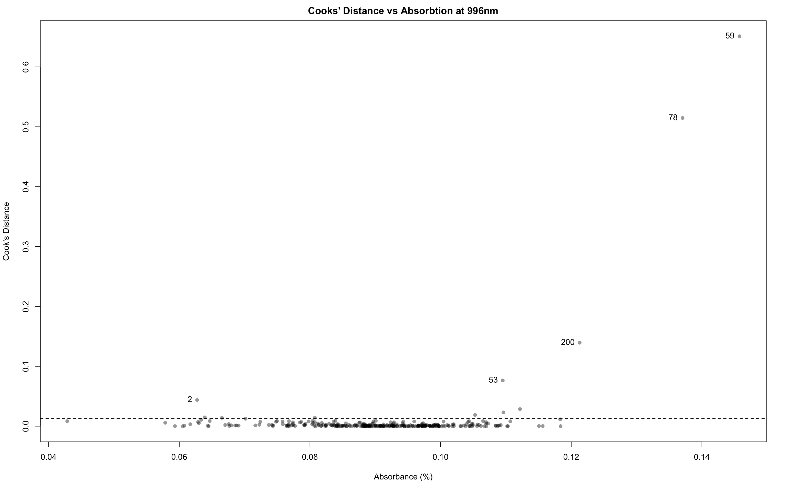

Observations 53, 59, 78 and 200 do however have a significant amount of distance between one another and as a result can be considered observations with high influence. Thus, we have removed these points going forward as in a simple model such as this, points with large influence will seriously be skewing any predictions we might make from them.

```{r}
# removing these influential points and creating a new model WITHOUT them

model.slm1 <- lm(Arom ~ X996, data = AromSpectra.train, subset = -c(53, 59, 78, 200))
#summary(model.slm1)
```

Here we've plotted side by side the exact same two previous figures, except using the data from the new model we've fit (having removed the high leverage points). The only difference being that we've plotted the standardised residuals against the fitted values, purely for convenience as after removing the high leverage points the actual absorption values differ in length compared to our new set of standardised residuals. However, in a simple linear model this actually produced the exact same plot so nothing has really changed.

We can see that by removing these high leverage points our new model has standardised residuals which are **much** less left skewed and are a lot closer to normally distributed. In the plot on the right we can also see how all our data is *sort of* consistently scattered. It is obvious that we're 'missing' some data from the lower portion of the fitted values, causing our variance to look a lot less constant. However, this could be attributed to what was mentioned during the EDA - there's a lot less observations for aromaticity in the 0% - 20% range (where data seems to be lacking in this plot), compared to the amount of observations from 30% - 40% (where data seems to be abundant in this plot).

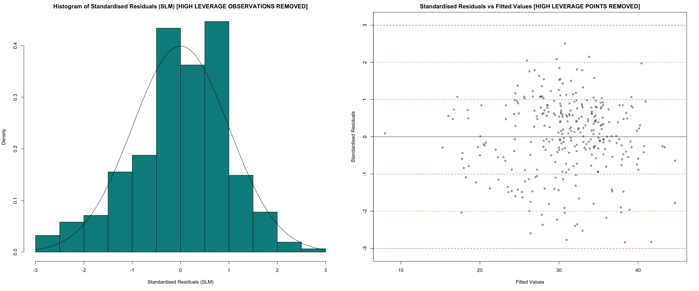

Understanding how these data were collected we came to the conclusion that testing for whether these data were independent would be a waste of time. There's no indication that our observations are somehow 'time series linked.' Each observation is a completely separate sample of diesel fuel which could have been tested by a completely different (similarly calibrated) spectrometer, on a completely different day, month, or even year. Thus, from understanding the data we came to the conclusion that it was independently collected.


***

## __Multiple Linear Regression__

The main issue that we face when trying to fit any multiple linear regression model is the shear amount of variables we have to work with; 225 explanatory variables with only 395 observations is a recipe for some gross over fitting, especially if not handled correctly. In an effort to counteract this, before we even think about making any sort of models or checking their validity, we need to reduce the amount of variables we're including within them.

### All Subsets (not viable)

Our first attempt at reducing the variables was to use the all subsets, 'brute force' approach. This method seeks to reduce the variables by fitting all possible models; starting from zero and to a set cut-off point. After these models have been fit we can take a mixture of different information criteria (adjusted R2, Mallows' CP, BIC) and plot them for each separately sized model. The points where adjusted R2 starts to taper off and Mallows' CP & BIC both reach a minimum and start to rise again gives us an indication of a handful of models, a subset, which should work well for our problem.

However, the problem is that this method of reducing variables is computationally costly; especially in our case with 225 variables. When running this method for models containing up to three variables it'll complete almost instantly, but setting the subset limit any higher than this and it'll take a *very* long time.

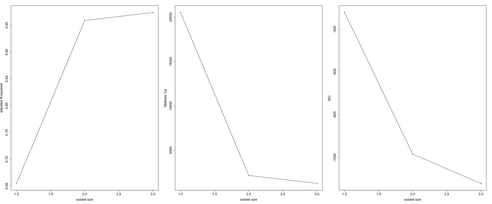

Although this method of variable reduction isn't really viable with the dataset we're working with, the process wasn't entirely useless. By analyzing the summary output for the subsets we managed to calculate we found that our best models with one, two and three variables were X996; X1012, X1016 and X990, X1010, X1018 respectively. This information was not only useful in helping us pick *the best* variable when fitting our simple linear model, but it's also interesting how all the variables it seems to be picking up as 'significant' in these models are quite close to each other.

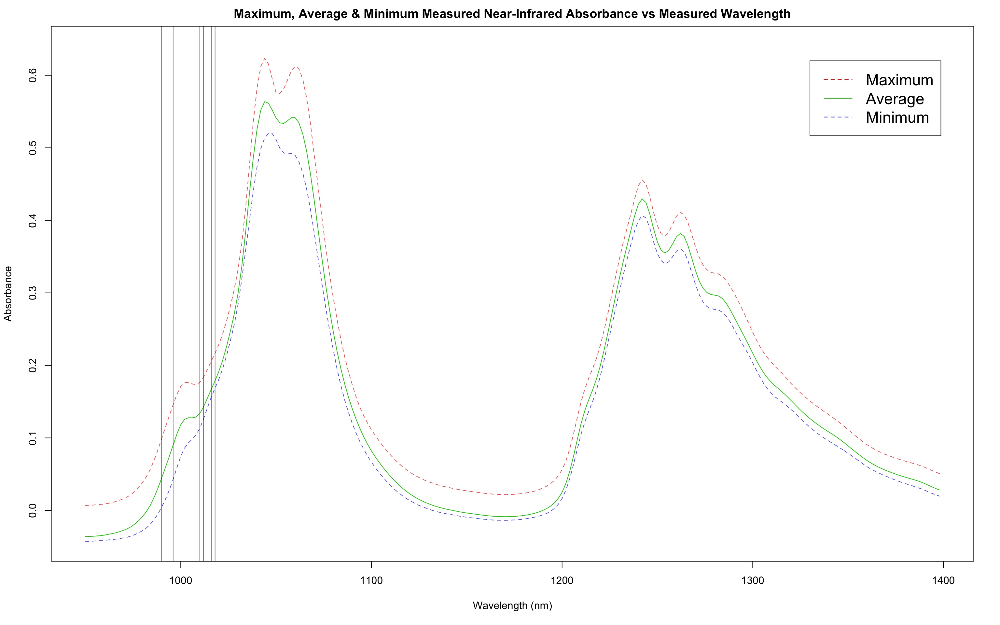

In the above figure vertical lines have been drawn at all the aforementioned variables that brute force reduction deemed *significant* up to models containing three variables. For the most part they're all situated either just before or after this 'flattened' point in the overall spectra profile. This could indicate that in a diesel fuel, this point in the spectra profile might be a little unique with respect to the fuel's aromaticity - making it stand out so early in the sub-setting process. 

### Stepwise Selection Methods

After all subsets wasn't really a viable way of reducing our variables we decided to try some stepwise selection methods as they work in a similar way but cost marginally less computationally.

```{r fwd, eval=FALSE}
# forward stepwise variable selection
# 22s on a MacBook Pro (2.7 GHz Intel Core i5)

model.fwd <- step(model.0, scope = formula(model.all), direction = "forward", trace = 0)
#summary(model.fwd)
```

```{r bwd, eval=FALSE}
# backward stepwise variable selection
# 2m20s on a MacBook Pro (2.7 GHz Intel Core i5)

model.bwd <- step(model.all, direction = "backward", trace = 0)
#summary(model.bwd)
```

```{r both, eval=FALSE}
# both-way stepwise variable selection
# 2m50s on a MacBook Pro (2.7 GHz Intel Core i5)

model.bth <- step(model.all, direction = "both", trace = 0)
#summary(model.bth)
```

However, after running forward selection we were still left with 82 variables and after running backwards and both-ways selection we were left with 146 variables. Subjectively, we thought these were both still too many variables to be working with in our dataset. As a method of reducing our variables even further after these stepwise selection algorithms we wanted to find **which variables were common within all of these variables**.

After we did this we were left with a much more concise model with 48 explanatory variables; marginally less than any of the previously considered model.

```{r}
# this is a 'combined' model which only includes all the COMMON variables from fwd, bwd and bth reduction
# couldn't think of a quicker way to convert a string-vector to a formula so I just copied it all out

model.cmb <- lm(Arom ~ X1002 + X1004 + X1020 + X1026 + X1030 + X1032 + X1040 + X1046 + X1054 + X1060 + X1084 + X1088 + X1094 + X1100 + X1112 + X1116 + X1128 + X1132 + X1134 + X1138 + X1148 + X1160 + X1180 + X1190 + X1194 + X1198 + X1200 + X1214 + X1232 + X1248 + X1250 + X1252 + X1264 + X1294 + X1300 + X1304 + X1310 + X1312 + X1318 + X1320 + X1324 + X1326 + X1328 + X1350 + X1376 + X1396 + X998, data = AromSpectra.train)
#summary(model.cmb)
```

Now that we have this more concise model; it was finally time to assess its validity. Seen in the following histogram the standardised residuals look pretty close to normally distributed, in fact they're almost symmetrical. However, there still exists a couple observations with residual values outside the third standard deviation.

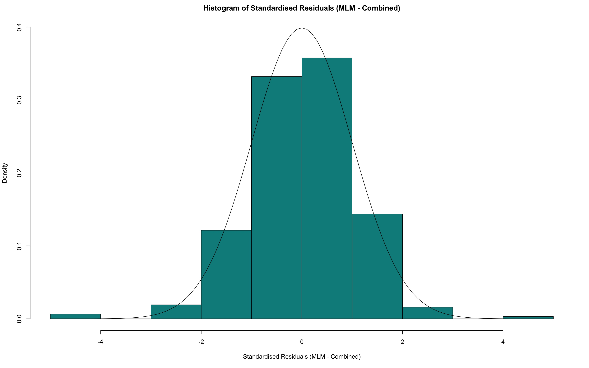

In the next figure we can see that, besides the couple outlying points, the data is *very* constantly scattered throughout the third standard deviations - satisfying our assumption that the residuals should have constant variance. At a glance it looks significantly more consistently distributed when compared to the simple model we've fitted previously. Of course we face the problem that we're lacking data for the lower and higher side of the fitted values, but that's to be expected due to the range of values for aromaticity we have to work with in our dataset.

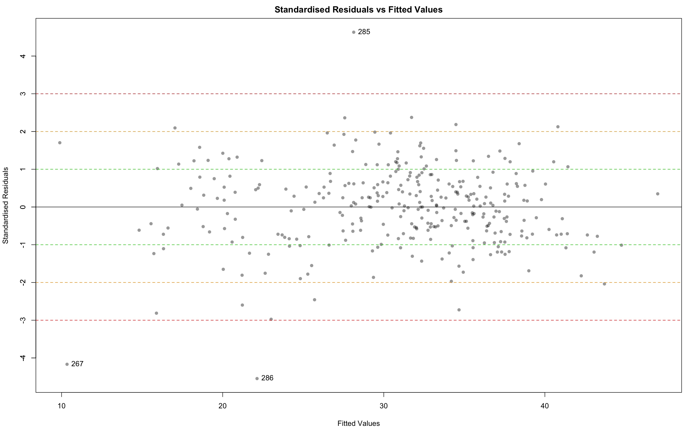

We've identified which points have unusually large residuals, but again that doesn't mean they have high leverage; to assess that we've plotted Cooks' Distance for each observation. Just like before we weren't concerned too much with the cut-off point, instead we focused on the large gaps between different points. As seen in the figure observations 267, 285 and 286 seem to be obvious influencing points.

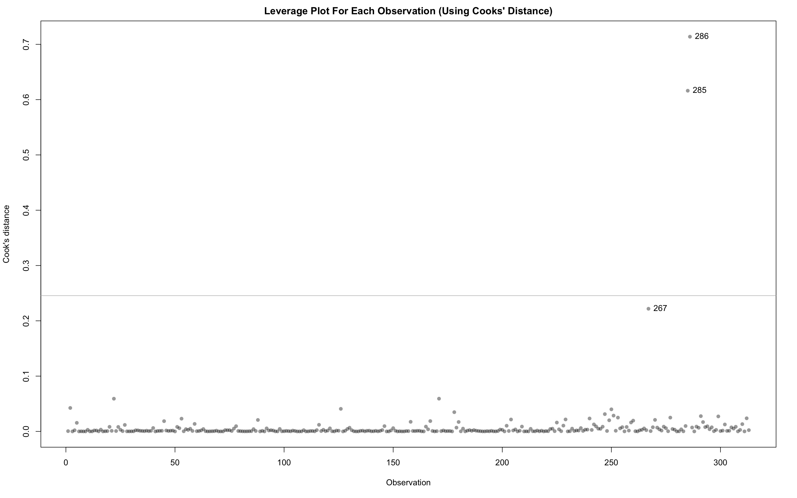

Due to these points having high leverage we thought it would be better to consider a model without them as they could be seriously skewing any predictions or inference we might make going forward.

```{r}
model.cmb1 <- lm(Arom ~ X1002 + X1004 + X1020 + X1026 + X1030 + X1032 + X1040 + X1046 + X1054 + X1060 + X1084 + X1088 + X1094 + X1100 + X1112 + X1116 + X1128 + X1132 + X1134 + X1138 + X1148 + X1160 + X1180 + X1190 + X1194 + X1198 + X1200 + X1214 + X1232 + X1248 + X1250 + X1252 + X1264 + X1294 + X1300 + X1304 + X1310 + X1312 + X1318 + X1320 + X1324 + X1326 + X1328 + X1350 + X1376 + X1396 + X998, data = AromSpectra.train, subset = -c(267, 285, 286))
```

After fitting the model without these high leverage points we figured it would we a good idea to perform the same diagnostic checks on our new model. The histogram is still ever so slightly left skewed however it is much closer to normally distributed than it was in the original mode. The **previous** standardised residual vs fitted values plot had only the three high leverage points outside the third standard deviations however, as can be seen in the following figure, after fitting the model **without** those points it's caused the spread to change slightly and observations 178 & 171 are now (barely) also sitting outside of the third standard deviation.

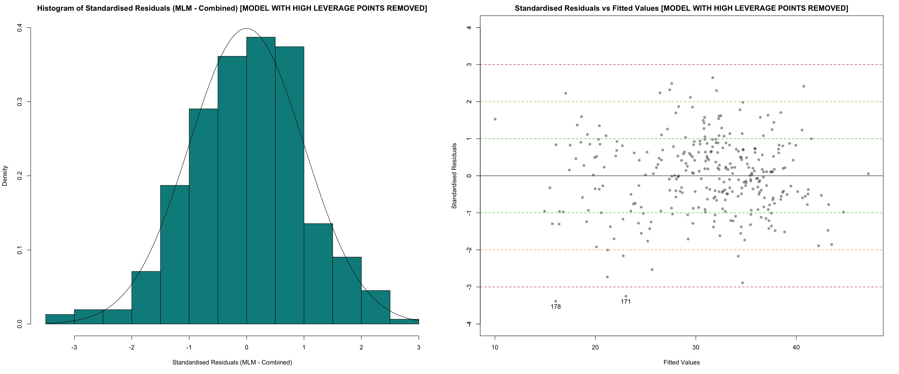

Due to this change, in the following figure we plotted side by side the same Cooks' Distance plot we previously had made, next to the Cooks' Distance plot for our newer model; just to make sure that these 'new outlying' points haven't become high leverage in our newer model. And thankfully, despite the shift in the previous standardised residual vs fitted values plot, there were no surprising high leverage points in our newer model.

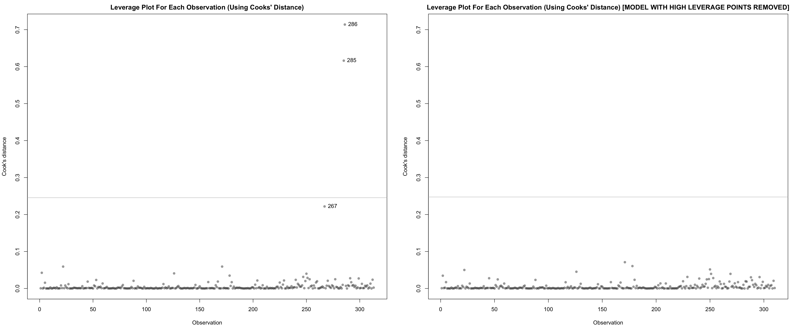

### Partial Least Squares

Partial Least Squares is more of a method for shrinking coefficients as opposed to flat out just selecting some subset. It actually estimates all parameter coefficients but many of these estimates are shrunk to close to zero making them much less significant in the resulting model. Throughout the PLS process similar, correlated variables are 'merged together' into linear combinations. The logic being that strongly correlated variables will act in a similar manner, so in that sense we can get away with combining them to reduce the overall complexity of the model.

Before we settle on a *best* Partial Least Squares (PLS) model we have to first figure our how many components we should be including in this model. To do this we've run PLS and found models of varying sizes, ranging from zero (no included explanatory variables) all the way up to 225 (all included explanatory variables). We then cross validated each one of these models, using some subset of the data as 'test data' and calculating the RMSEP value for each differently sized model.

```{r, fig.width=8, fig.height=5, eval = FALSE, warning=FALSE, message=FALSE}
# loading in the library for Partial Least Squares (PLS)
require(pls)

pls.fit <- plsr(Arom ~ ., data = AromSpectra.train, scale = TRUE, validation = "CV")
#validationplot(pls.fit, main = "Cross Validation of RMSEP for Varying Sizes of PLS Models", xlab = "Number of Included Explanatory Variables")
#summary(pls.fit)
```

As seen in the following figure, the models with the lowest RMSEP seem to be around the point of 20 included components. This means that by combining all 225 of our variables into just 20 linear combinations, we're left with a model which gives us the best predictions - according to cross validation.

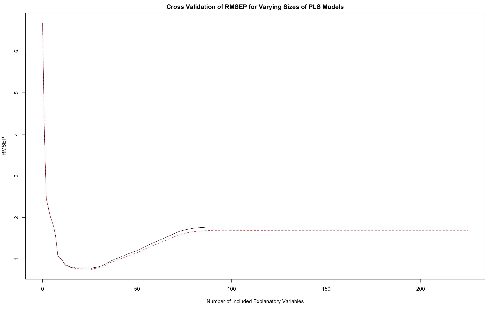

Before we went ahead and made predictions from the PLS model with 20 components we found to be *best*, we first wanted to actually look at how all the individual parameter coefficients have changed.

In the following figure, each bar represents the shrunken values for each parameter coefficient and the red line is simply a line graph of the same values. The green line however is the exact same 'green average line' that can be seen on the maximum, average and minimum absorption figures in our EDA; the only difference being that the values have been re-scaled so they can be plotted relative to these shrunk coefficients.

Funnily enough, the before and after of the 'flattening point' that was mentioned in the brute force subset selection method as being significant (because all the selected variables were around it), seems to also be just as significant in this case. This can be seen as the largest coefficient values seem to occur just before this point and then the lowest coefficient values seem to occur just after this point. Again, this indicates that maybe this specific part of the spectra profile is 'telling' of how much aromaticity a diesel fuel might have. 

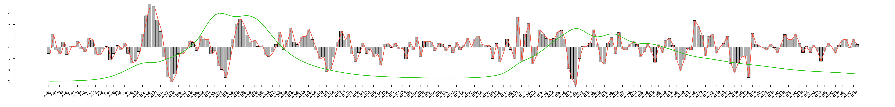

### LASSO

LASSO is another method of shrinking the parameter coefficients however, unlike PLS we're not looking at linear combinations. Instead we're just minimizing the residual sum of squares (like in least squares), except we're also adding the constraint that the sum of the absolute values of all the parameter coefficients should be *pretty small* (where *pretty small* is determined by the arbitrary value you give to $\lambda$.

```{r, warning=FALSE, message=FALSE}
require(glmnet)

# grabbing y-values
y <- AromSpectra.train$Arom
# converting everything else to X-matrix
X <- as.matrix.data.frame(AromSpectra.train[, -1]) 

# running lasso for a set range of values for lambda
model.lasso <- glmnet(X, y)
# running cross validation for these various models and finding the error
model.lasso.cv <- cv.glmnet(X, y, type.measure = "mse", alpha = 1)
```

Just like in PLS, we have to use cross validation figure out the *best* amount of components to use in our model. Except this time we're cross validating the mean-squared error against different values for $\lambda$. As seen in the right side plot of the following figure, the *lowest* mean-squared error occurs roughly around a value of $\lambda = -5$, which results in around 37 parameters being included into the model. The plot of the left side shows exactly which variables are being included in this range however, due to there being 37 separate lines it's hard to pick out exactly what is being included.

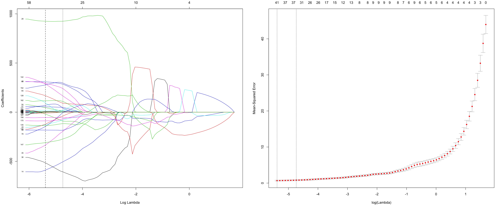

Instead of trying to identify which lines are unique within that range and what variable they correspond to, we wrote a chunk of code which identifies exactly which one's they are; saving us the effort of having to scroll through the summary with 225 lines of output (most of which are blank). And as we can see the cross validated *best* LASSO model has 39 variables (including the intercept).

```{r}
# 39 variables seleceted after cross-validation (including intercept)
# this chunk is giving different output in the knitted HTML compared to running it through Rmarkdown???

#coef(model.lasso.cv)
c("Intercept", Wavelength[which((coef(model.lasso.cv) == 0) == FALSE)-1])
```

*Despite the code being the exact same in this chunk and the preceeding chunks, for some reason when being knitted to HTML it is showing completely different output than when it is run through the code chunks, so I've provided a screenshot of what the actual values should be.*

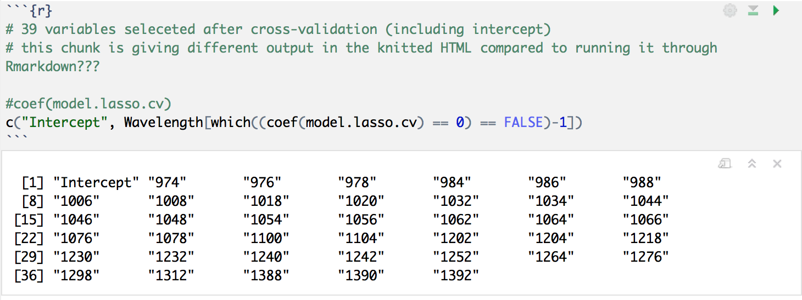

***

## __Conclusion__

To begin with we split our data into a training set (80%) and a testing set (20%). To evaluate our models that we've created from the training set we had them predict estimates for aromaticity given the parameter values in our test set. We then compared these predicted estimates for aromaticity against the actual values for aromaticity in our testing set. From these sets of values we calculated the RMSEP (lower is better), and plotted the predicted vs actual values. In a *perfect model* all points would sit along a 45 degree line, so the closer the points are to the drawn line the better the predictions.

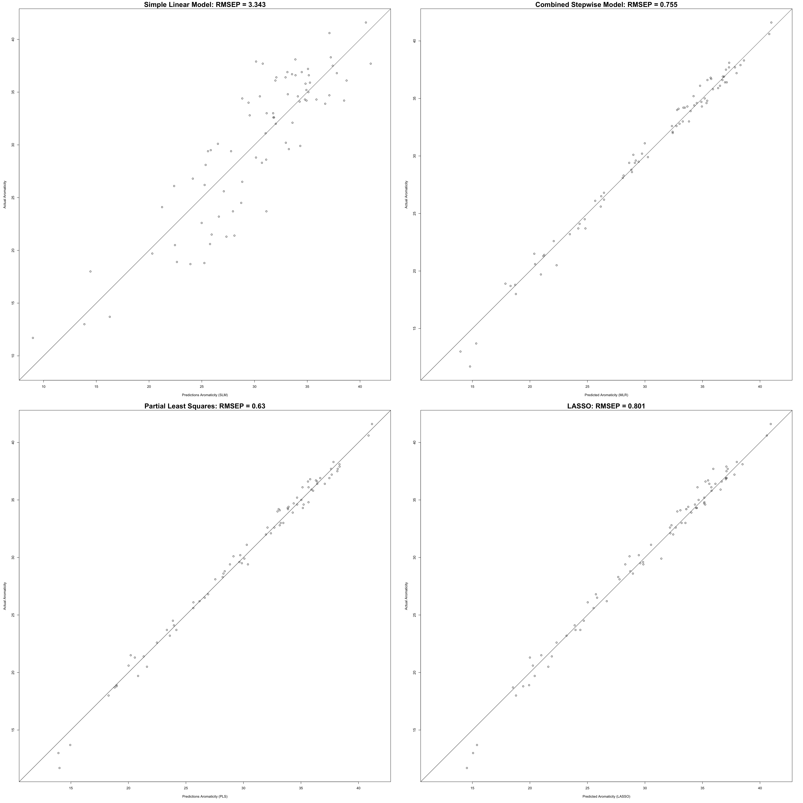

1. As seen in the colour correlation plot we created; *a lot* of our explanatory variables are strongly correlated. This means that PLS should result in one of the better models given the nature of the data we're working with. And unsurprisingly, *it did!* Although not by much, our **partial least squares model** did have the lowest RMSEP, therefore making it *the best* model for predicting aromaticity in diesel fuels when compared to all other models we created. Not only did it have the best prediction accuracy, but it also only had 20 components, making it the model with **least** amount of explanatory variables. However, considering its 20 components are linear combinations of all parameters it means that you'd still have to measure the majority of the wavelengths to get accurate predictions from this model. 

2. Our **combined stepwise selected model** came in second place in terms of prediction accuracy. With 48 explanatory variables, utilizing over $1/5$ of the total variables we have to work with; it's still quite a complex model. However, unlike the PLS model none of its selected variables are linear combinations, meaning that in a practical sense you could probably save on $4/5$ the cost of operating an expensive spectrometer as you only have to measure 48 of the 225 previously tested wavelengths.

3. The **LASSO model** came in third place with respect to its predictive ability. However, it was only third place by a very small amount; realistically the LASSO model and combined stepwise model have roughly the same predictive ability. Especially considering the fact that the LASSO model is using 36 explanatory variables; making it 25% more simple (in terms of parameters) when compared to the combined stepwise model. As mentioned this added simplicity can have cost saving benefits in practical applications and could also lead to better predictions when given new data. For these reasons we'd be tempted to even move this model into second place, *or at the very least call it a tie* for second place.

4. Unsurprisingly, our **simple linear model** came in fourth (last) place in terms of its ability to predict aromaticity in diesel fuels. However, this **doesn't** mean it's useless. It's predictions aren't really *that* bad, especially considering that it's only predicting using the absorption measured at one particular wavelength. It all depends on how accurate the predictive models need to be for practical applications as to how much use this model could actually see. If you just need a 'quick and dirty' way to get a ballpark idea of a diesel fuels aromaticity then this could be a suitable model (especially if trained on more data).

***
***

## __Appendix__

### EDA

```{r, eval=FALSE}
# a function for calculating RMSEP, used all throughout project so might as well define it first off to prevent errors

rmsep <- function(y, ypred){
  sqrt(sum((y - ypred)^2)/length(y))
}
```

```{r, eval=FALSE}
# loading in the data

print(load("S2_2017_STAT1000_ProjectData.RData"))
```

```{r, eval=FALSE}
# attaching our explanatory variable to all the explanatory variables

AromSpectra <- cbind(Arom, ASpectra)
#head(AromSpectra)
```

```{r, eval=FALSE}
# renaming the index as they're out of order (due to prior cleaning); this is useful for finding outliers when we come to that

rownames(AromSpectra) <- 1:nrow(AromSpectra)
rownames(ASpectra) <- 1:nrow(ASpectra)
```

```{r, fig.width=20, fig.height=20, eval=FALSE}
# colour correlation plot of all the variables
# fig width + height have been adjusted so plot can somewhat be interpretted
# eval = FALSE as I've got a .jpg of the result already

require(corrplot)
corrplot(cor(AromSpectra))

# can see a big blue mass as neighbouring parts of the spectra seem to be rising together; the white/red spots could be attributed to the max points and the decreasing parts of the spectra maybe?
```

```{r, fig.width=8, fig.height=3, eval=FALSE}
par(mfrow=c(1,2))

hist(Arom, col = "red3", main = "Histogram of All Observations For Aromaticity", 
     xlab = "Mass Percentage of Total Aromatic Compounds (Arom)")
# histogram of our response variable
# slightly skewed but loosely normal
# suggests maybe that there's a certain mean/max point of aromocity within our substances; as nothing ever really gets above 50% 

boxplot(Arom, col = "red3", main = "Boxplot of All Observations For Aromaticity")
# boxplot of our response variable
# shows a handful of 'outliers'
# shows that we don't have many observations of very low yielding aromicty substances?
```

```{r, fig.width=8, fig.height=5, eval=FALSE}
# each line is a set of observations (row in our dataset)

plot(Wavelength, as.numeric(ASpectra[1,]), ylab = "Absorbance", xlab = "Wavelength (nm)", type = "l", ylim = c(min(ASpectra),max(ASpectra)), main = "Measured Near-Infrared Absorbance vs Measured Wavelength")
for (row in c(2:nrow(ASpectra))){
  lines(Wavelength, as.numeric(ASpectra[row,]), col = rgb(1,0,0,alpha = 0.2))
}

# it's clear that there's at least two clear outlying observations within our dataset
# could be more as it's hard to tell which lines are unique when they pass through the mass
```

```{r, fig.width=8, fig.height=5, eval=FALSE}
# a better (more concise) version of the above plot
# green line - average; red dashed - max; blue dashed - min
# need to make a legend
# again, our minimums values are almost inline with the average; compared to the max values which are MUCH further away due to those two outlying observations 

plot(Wavelength, apply(ASpectra, 2, mean), type = "l", col = "green3", ylim = c(min(ASpectra),max(ASpectra)), ylab = "Absorbance", xlab = "Wavelength (nm)", 
     main = "Maximum, Average & Minimum Measured Near-Infrared Absorbance vs Measured Wavelength")
lines(Wavelength, apply(ASpectra, 2, min), col = rgb(0,0,1,alpha=0.7), lty = "dashed")
lines(Wavelength, apply(ASpectra, 2, max), col = rgb(1,0,0,alpha=0.7), lty = "dashed")

legend(1330, 0.62, c("Maximum", "Average", "Minimum"), lty = c("dashed", "solid", "dashed"),
       col = c("red", "green3", "blue"), cex = 1.5)
```

```{r, eval=FALSE}
# FINDING THE OUTLIERS

# this function calculates the max value if N = 1, the second largest number if N = 2, the third largest number if N = 3; etc, etc
# what I've done is used this to find the index of the 1st, 2nd and 3rd largest observations for each tested wavelength (all columns)

maxN <- function(x, N=2){
  len <- length(x)
  if(N>len){
    warning('N greater than length(x).  Setting N=length(x)')
    N <- length(x)
  }
  sort(x,partial=len-N+1)[len-N+1]
}

# 1st largest (just used which.max)
max_index <- c()
for (i in 1:225) max_index[i] <- which.max(ASpectra[,i])
cat("Largest Observations:") # just making the output more readable as this is a busy chunk
sort(unique(max_index))
# 4, 306, 314

# 2nd largest
max_index2 <- c()
for (i in 1:225) max_index2[i] <- which(ASpectra[,i] == maxN(ASpectra[,i], 2))
cat("2nd Largest Observations:") # just making the output more readable as this is a busy chunk
sort(unique(max_index2))
# 4! , 99, 306!, 314!

# 3rd largest
max_index3 <- c()
for (i in 1:225) max_index3[i] <- which(ASpectra[,i] == maxN(ASpectra[,i], 3))
cat("3rd Largest Observations:") # just making the output more readable as this is a busy chunk
sort(unique(max_index3))
# 2, 4!!, 6, 99!, 145, 306!!, 314!!, 350, 370

# combining them all together and finding the unique values
cat("\nCombined & Unique:") # just making the output more readable as this is a busy chunk
sort(unique(c(max_index, max_index2, max_index3)))


# rows/observations: 2, 4, 6, 99, 145, 306, 314, 350, 370
# are all candidates for being outlying observations, with 4, 306 and 314 (and sort of 99) being more 'significant'
```

```{r, fig.width=12, fig.height=5, eval=FALSE}
# LEFT: no outliers removed ; RIGHT: all 'outliers' removed

par(mfrow=c(1,2))

# plot 1 - full set; NO outliers removed
plot(Wavelength, apply(ASpectra, 2, mean), type = "l", col = "green3", ylim = c(min(ASpectra),max(ASpectra)), ylab = "Absorbance", xlab = "Wavelength (nm)", 
     main = "NO Candidate Outliers Removed")
lines(Wavelength, apply(ASpectra, 2, min), col = rgb(0,0,1,alpha=0.7), lty = "dashed")
lines(Wavelength, apply(ASpectra, 2, max), col = rgb(1,0,0,alpha=0.7), lty = "dashed")

legend(1330, 0.66, c("Maximum", "Average", "Minimum"), lty = c("dashed", "solid", "dashed"),
       col = c("red", "green3", "blue"), cex = 1.3)

# plot 2 - removing all rows which show up in the largest 3 observations for each X-variable
plot(Wavelength, apply(ASpectra[-c(2, 4, 6, 99, 145, 306, 314, 350, 370),], 2, mean), 
     type = "l", col = "green3", ylim = c(min(ASpectra),max(ASpectra)), ylab = "Absorbance", 
     xlab = "Wavelength (nm)", main = "ALL Candidate Outliers Removed (2, 4, 6, 99, 145, 306, 314, 350, 370)")
lines(Wavelength, apply(ASpectra[-c(2, 4, 6, 99, 145, 306, 314, 350, 370),], 2, min), col = rgb(0,0,1,alpha=0.7), lty = "dashed")
lines(Wavelength, apply(ASpectra[-c(2, 4, 6, 99, 145, 306, 314, 350, 370),], 2, max), col = rgb(1,0,0,alpha=0.7), lty = "dashed")

legend(1330, 0.66, c("Maximum", "Average", "Minimum"), lty = c("dashed", "solid", "dashed"),
       col = c("red", "green3", "blue"), cex = 1.3)
```

```{r, fig.width=12, fig.height=5, eval=FALSE}
# LEFT: 'obvious/significant' outliers removed ; RIGHT: all 'outliers' removed

par(mfrow=c(1,2))

# plot 1 - removing 'obvious' outliers
plot(Wavelength, apply(ASpectra[-c(4, 99, 306, 314),], 2, mean), type = "l", col = "green3", 
     ylim = c(min(ASpectra),max(ASpectra)), ylab = "Absorbance", xlab = "Wavelength (nm)",
     main = "ONLY Obvious Candidate Outliers Removed (4, 99, 306, 314)")
lines(Wavelength, apply(ASpectra[-c(4, 99, 306, 314),], 2, min), col = rgb(0,0,1,alpha=0.7), lty = "dashed")
lines(Wavelength, apply(ASpectra[-c(4, 99, 306, 314),], 2, max), col = rgb(1,0,0,alpha=0.7), lty = "dashed")

legend(1330, 0.66, c("Maximum", "Average", "Minimum"), lty = c("dashed", "solid", "dashed"),
       col = c("red", "green3", "blue"), cex = 1.3)

# plot 2 - removing all rows which show up in the largest 3 observations for each X-variable
plot(Wavelength, apply(ASpectra[-c(2, 4, 6, 99, 145, 306, 314, 350, 370),], 2, mean), 
     type = "l", col = "green3", ylim = c(min(ASpectra),max(ASpectra)), ylab = "Absorbance", 
     xlab = "Wavelength (nm)", main = "ALL Candidate Outliers Removed (2, 4, 6, 99, 145, 306, 314, 350, 370)")
lines(Wavelength, apply(ASpectra[-c(2, 4, 6, 99, 145, 306, 314, 350, 370),], 2, min), col = rgb(0,0,1,alpha=0.7), lty = "dashed")
lines(Wavelength, apply(ASpectra[-c(2, 4, 6, 99, 145, 306, 314, 350, 370),], 2, max), col = rgb(1,0,0,alpha=0.7), lty = "dashed")

legend(1330, 0.66, c("Maximum", "Average", "Minimum"), lty = c("dashed", "solid", "dashed"),
       col = c("red", "green3", "blue"), cex = 1.3)
```

```{r, fig.width=8, fig.height=5, eval=FALSE}
plot(Wavelength, apply(ASpectra, 2, mean), type = "l", col = "green2", ylim = c(min(ASpectra),max(ASpectra)), ylab = "Absorbance", xlab = "Wavelength (nm)", 
     main = "Obvious Outlying Sets of Observations Against the Average Set of Observations")

lines(Wavelength, ASpectra[4,], col = rgb(0,0,1,alpha=0.8), lty = "dashed") # blue
lines(Wavelength, ASpectra[99,], col = rgb(1,0,1,alpha=0.8), lty = "dashed") # pink
lines(Wavelength, ASpectra[306,], col = rgb(0,0,0,alpha=0.8), lty = "dashed") # black
lines(Wavelength, ASpectra[314,], col = "tomato", lty = "dashed") #lblue

legend(1315, 0.64, c("Average", "Observation: 4", "Observation: 99", "Observation: 306", 
                     "Observation: 314"), 
       lty = c("solid", "dashed", "dashed", "dashed", "dashed"), 
       col = c("green2", rgb(0,0,1,alpha=0.8), rgb(1,0,1,alpha=0.8), rgb(0,0,0,alpha=0.8),
               "tomato"), cex = 1.5)
```

```{r, eval=FALSE}
# from this EDA I think it makes sense and we're justified in removing observations (rows) 4, 99, 306 and 314 from our dataset
# I'd say they're definitely anomalies (maybe miscalibrated NIR instrument); whatever the reason they'd be skewing our data, and therefore any models we might make from it

AromSpectra.out <- AromSpectra[-c(4, 99, 306, 314),]
ASpectra.out <- ASpectra[-c(4, 99, 306, 314)]
```

```{r, eval=FALSE}
# making the test set (randomly chosen 20%), and the training set (the remaining 80%)

set.seed(05011998)
test.index <- sample(nrow(AromSpectra.out), (floor(0.2*nrow(AromSpectra.out))))
AromSpectra.test <- AromSpectra.out[test.index,]
AromSpectra.train <- AromSpectra.out[-test.index,]
```

***

### SLR

```{r, eval=FALSE}
# the SLM with the variable that forward selection AND brute force all subsets deemed to be the 'most significant'

model.slm <- lm(Arom ~ X996, data = AromSpectra.train)
#summary(model.slm)
```

```{r, fig.width=8, fig.height=5, eval=FALSE}
# standardised residuals INCLUDING OUTLIERS

stdres.slm <- rstandard(model.slm)
hist(stdres.slm, main = "Histogram of Standardised Residuals (SLM)", col = "darkcyan", xlab = "Standardised Residuals (SLM)", freq = FALSE)
x <- seq(-4, 4, by=0.02)
curve(dnorm(x), add = TRUE)
```

```{r, fig.width=8, fig.height=5, eval=FALSE}
# standardized residuals vs actual values INCLUDING OUTLIERS

plot(stdres.slm ~ X996, data = AromSpectra.train, pch = 16, col = rgb(0,0,0, alpha = 0.4), ylab = "Standardised Residuals", xlab = "Absorbance (%)", main = "Standardised Residuals vs Absorbtion at 996nm")
axis(2, at = c(-6:6))
abline(h = 0)
abline(h = c(-3,3), lty = 2, col = "red2")
abline(h = c(-2,2), lty = 2, col = "orange2")
abline(h = c(-1,1), lty = 2, col = "green3")
text(AromSpectra.train$X996[c(53, 59, 78, 200)], stdres.slm[c(53, 59, 78, 200)], labels = c(53, 59, 78, 200), pos = 2)
```

```{r, fig.width=8, fig.height=5, eval=FALSE}
# indentifying the influential points in our model using Cooks' Distance

#CooksD <- cooks.distance(model.slm)

plot(cooks.distance(model.slm) ~ X996, data = AromSpectra.train, xlab = "Absorbance (%)", ylab = "Cook's Distance", pch = 16, col = rgb(0,0,0, alpha = 0.4), main = "Cooks' Distance vs Absorbtion at 996nm")
abline(h = 4/(nrow(AromSpectra.train) - 2), lty = 2)
text(AromSpectra.train$X996[c(2, 53,  59,  78, 200)], cooks.distance(model.slm)[c(2, 53,  59,  78, 200)], labels = c(2, 53,  59,  78, 200), pos = 2)
```

```{r, eval=FALSE}
# removing these influential points and creating a new model WITHOUT them

model.slm1 <- lm(Arom ~ X996, data = AromSpectra.train, subset = -c(53, 59, 78, 200))
#summary(model.slm1)
```

```{r, fig.width=12, fig.height=5, eval=FALSE}
par(mfrow = c(1,2))

# standardised residuals EXCLUDING INFLUENTIAL POINTS

stdres.slm1 <- rstandard(model.slm1)
hist(stdres.slm1, main = "Histogram of Standardised Residuals (SLM) [HIGH LEVERAGE OBSERVATIONS REMOVED]", col = "darkcyan", xlab = "Standardised Residuals (SLM)", freq = FALSE)
x <- seq(-4, 4, by=0.02)
curve(dnorm(x), add = TRUE)

# standard residuals vs fitted values EXCLUDING INFLUENTIAL POINTS

plot(model.slm1$fitted.values, stdres.slm1, xlab = "Fitted Values", ylab = "Standardised Residuals", pch = 16, col = rgb(0,0,0, alpha = 0.4), ylim = c(-3.1, 3.1), main = "Standardised Residuals vs Fitted Values [HIGH LEVERAGE POINTS REMOVED]")
axis(2, at = c(-4:4))
abline(h = 0)
abline(h = c(-3,3), lty = 2, col = "red2")
abline(h = c(-2,2), lty = 2, col = "orange2")
abline(h = c(-1,1), lty = 2, col = "green3")
```

```{r, fig.width=8, fig.height=5, eval=FALSE}
# comparing both models visually using their qqnorm

qqnorm(stdres.slm, col = rgb(0,0,1, alpha=0.5), ylim = range(stdres.slm, stdres.slm1))
qqline(stdres.slm, col = "blue")
par(new=T)
qqnorm(stdres.slm1, col = rgb(1,0,0, alpha=0.5), ylim = range(stdres.slm, stdres.slm1))
qqline(stdres.slm1, col = "red")

#qqnorm(y1, ylim=range(y1, y2), col="blue")
#par(new=T)
#qqnorm(y2, ylim=range(y1, y2), col="red")
```

```{r, fig.width=8, fig.height=8, eval=FALSE}
# finding predictions using SLM (without outliers)
slm.pred <- predict(model.slm1, newdata = AromSpectra.test[,-1])

# finding the RMSEP for the SLM predictions
slm.rmsep <- rmsep(slm.pred, AromSpectra.test$Arom)

# plotting actual values vs SLM predictions
par(pty = "s")
Range <- range(c(AromSpectra.test$Arom, slm.pred))
plot(AromSpectra.test$Arom ~ slm.pred, 
     xlab = "Predictions Aromaticity (SLM)", ylab = "Actual Aromaticity", 
     main = paste("Simple Linear Model: RMSEP =", round(slm.rmsep, 3)),
     xlim = Range, ylim = Range, data = AromSpectra.test, cex.main = 2)
abline(0, 1)
```

***

### MLR

#### Stepwise Selection Methods

```{r, eval=FALSE}
# model with no explanatory variables

model.0 <- lm(Arom ~ 1, data = AromSpectra.train)
#summary(model.0)
```

```{r, eval=FALSE}
# model with all possible explanatory variables

model.all <- lm(Arom ~ ., data = AromSpectra.train)
#summary(model.all)
```

```{r, eval=FALSE}
# forward stepwise variable selection
# 22s on a MacBook Pro (2.7 GHz Intel Core i5)

model.fwd <- step(model.0, scope = formula(model.all), direction = "forward", trace = 0)
#summary(model.fwd)
```

```{r, eval=FALSE}
# backward stepwise variable selection
# 2m20s on a MacBook Pro (2.7 GHz Intel Core i5)

model.bwd <- step(model.all, direction = "backward", trace = 0)
#summary(model.bwd)
```

```{r, eval=FALSE}
# both-way stepwise variable selection
# 2m50s on a MacBook Pro (2.7 GHz Intel Core i5)

model.bth <- step(model.all, direction = "both", trace = 0)
#summary(model.bth)
```

```{r, eval=FALSE}
# finding the variables which show up in the forwards selection AND backwards selection AND both-ways selection

a <- sort(names(model.fwd$coefficients[-1]))
b <- sort(names(model.bwd$coefficients[-1]))
c <- sort(names(model.bth$coefficients[-1]))

#length(a); length(b); length(c); length(Reduce(intersect, list(a,b,c)))

Reduce(intersect, list(a,b,c))
```

```{r, eval=FALSE}
# this is a 'combined' model which only includes all the COMMON variables from fwd, bwd and bth reduction
# couldn't think of a quicker way to convert a string-vector to a formula so I just copied it all out

model.cmb <- lm(Arom ~ X1002 + X1004 + X1020 + X1026 + X1030 + X1032 + X1040 + X1046 + X1054 + X1060 + X1084 + X1088 + X1094 + X1100 + X1112 + X1116 + X1128 + X1132 + X1134 + X1138 + X1148 + X1160 + X1180 + X1190 + X1194 + X1198 + X1200 + X1214 + X1232 + X1248 + X1250 + X1252 + X1264 + X1294 + X1300 + X1304 + X1310 + X1312 + X1318 + X1320 + X1324 + X1326 + X1328 + X1350 + X1376 + X1396 + X998, data = AromSpectra.train)
#summary(model.cmb)
```

```{r, fig.width=8, fig.height=5, eval=FALSE}
stdres.cmb <- rstandard(model.cmb)

hist(stdres.cmb, main = "Histogram of Standardised Residuals (MLM - Combined)", col = "darkcyan", xlab = "Standardised Residuals (MLM - Combined)", freq = FALSE, ylim = c(0, 0.4))
x <- seq(-4, 4, by=0.02)
curve(dnorm(x), add = TRUE)
```

```{r, fig.width=8, fig.height=5, eval=FALSE}
# standard residuals vs fitted values for COMBINED STEPWISE SELECTED MODEL

plot(model.cmb$fitted.values, stdres.cmb, xlab = "Fitted Values", ylab = "Standardised Residuals", pch = 16, col = rgb(0,0,0, alpha = 0.4), main = "Standardised Residuals vs Fitted Values")
axis(2, at = c(-4:4))
abline(h = 0)
abline(h = c(-3,3), lty = 2, col = "red2")
abline(h = c(-2,2), lty = 2, col = "orange2")
abline(h = c(-1,1), lty = 2, col = "green3")

text(model.cmb$fitted.values[c(267, 285, 286)], stdres.cmb[c(267, 285, 286)], labels = c(267, 285, 286), pos = 4)

#identify(model.cmb$fitted.values, stdres.cmb)
# 267, 285, 286
```

```{r, fig.width=8, fig.height=5, eval=FALSE}
plot(cooks.distance(model.cmb), ylab = "Cook's distance", xlab = "Observation", pch = 16, col = rgb(0,0,0, alpha = 0.4), main = "Leverage Plot For Each Observation (Using Cooks' Distance)")
abline(h = 2 * (length(coef(model.cmb))) / nrow(AromSpectra.out), col = "grey")

text(c(267, 285, 286), cooks.distance(model.cmb)[c(267, 285, 286)], labels = c(267, 285, 286), pos = 4)

# 267, 285, 286
```

```{r, eval=FALSE}
model.cmb1 <- lm(Arom ~ X1002 + X1004 + X1020 + X1026 + X1030 + X1032 + X1040 + X1046 + X1054 + X1060 + X1084 + X1088 + X1094 + X1100 + X1112 + X1116 + X1128 + X1132 + X1134 + X1138 + X1148 + X1160 + X1180 + X1190 + X1194 + X1198 + X1200 + X1214 + X1232 + X1248 + X1250 + X1252 + X1264 + X1294 + X1300 + X1304 + X1310 + X1312 + X1318 + X1320 + X1324 + X1326 + X1328 + X1350 + X1376 + X1396 + X998, data = AromSpectra.train, subset = -c(267, 285, 286))
```

```{r, fig.width=12, fig.height=5, eval=FALSE}
par(mfrow = c(1,2))

stdres.cmb1 <- rstandard(model.cmb1)

hist(stdres.cmb1, main = "Histogram of Standardised Residuals (MLM - Combined) [MODEL WITH HIGH LEVERAGE POINTS REMOVED]", col = "darkcyan", xlab = "Standardised Residuals (MLM - Combined)", freq = FALSE, ylim = c(0, 0.4))
x <- seq(-4, 4, by=0.02)
curve(dnorm(x), add = TRUE)

plot(model.cmb1$fitted.values, stdres.cmb1, xlab = "Fitted Values", ylab = "Standardised Residuals", pch = 16, col = rgb(0,0,0, alpha = 0.4), ylim = c(-4,4), main = "Standardised Residuals vs Fitted Values [MODEL WITH HIGH LEVERAGE POINTS REMOVED]")
axis(2, at = c(-4:4))
abline(h = 0)
abline(h = c(-3,3), lty = 2, col = "red2")
abline(h = c(-2,2), lty = 2, col = "orange2")
abline(h = c(-1,1), lty = 2, col = "green3")

text(model.cmb1$fitted.values[c(171, 178)], stdres.cmb1[c(171, 178)], labels = c(171, 178), pos = 1)
```

```{r, fig.width=12, fig.height=5, eval=FALSE}
par(mfrow=c(1,2))

# plot 1
plot(cooks.distance(model.cmb), ylab = "Cook's distance", xlab = "Observation", pch = 16, col = rgb(0,0,0, alpha = 0.4), main = "Leverage Plot For Each Observation (Using Cooks' Distance)")
abline(h = 2 * (length(coef(model.cmb))) / nrow(AromSpectra.out), col = "grey")

text(c(267, 285, 286), cooks.distance(model.cmb)[c(267, 285, 286)], labels = c(267, 285, 286), pos = 4)


# plot 2
plot(cooks.distance(model.cmb1), ylab = "Cook's distance", xlab = "Observation", pch = 16, col = rgb(0,0,0, alpha = 0.4), ylim = c(min(cooks.distance(model.cmb)), max(cooks.distance(model.cmb))), main = "Leverage Plot For Each Observation (Using Cooks' Distance) [MODEL WITH HIGH LEVERAGE POINTS REMOVED]")
abline(h = 2 * (length(coef(model.cmb1))) / (nrow(AromSpectra.out)-3), col = "grey")
```

```{r, eval=FALSE}
cmb1.pred <- predict(model.cmb1, newdata = AromSpectra.test[,-1])
```

```{r, fig.width=8, fig.height=8, eval=FALSE}
cmb1.rmsep <- rmsep(AromSpectra.test$Arom, cmb1.pred)

par(pty = "s")
Range.cmb1 <- range(c(cmb1.pred, AromSpectra.test$Arom))
plot(cmb1.pred, AromSpectra.test$Arom,
     xlab = "Predicted Aromaticity (MLR)", ylab = "Actual Aromaticity",
     xlim = Range.cmb1, ylim = Range.cmb1, 
     main = paste("Combined Stepwise Model: RMSEP =", round(cmb1.rmsep, 3)), cex.main = 2)
abline(0, 1)
```

#### All Subsets (not viable)

```{r, eval=FALSE}
# bruteforce all subset variable selection method
# anything above nvmax = 3 takes a VERY long time (2.7 GHz Intel Core i5)

require(leaps)
AllSubsets <- regsubsets(Arom ~ ., nvmax = 3, data = AromSpectra.train, really.big = TRUE)
AllSubsets.summary <- summary(AllSubsets)
#summary(AllSubsets)

# results for nvmax = 3 are as follows:
# X996
# X1012, X1016
# X990, X1010, X1018

# no 'cross-overs' however variables being picked seem to be very close to each other
```

```{r, fig.width=8, fig.height=5, eval=FALSE}
plot(Wavelength, apply(ASpectra[-c(4, 99, 306, 314),], 2, mean), type = "l", col = "green3", ylim = c(min(ASpectra),max(ASpectra)), ylab = "Absorbance", xlab = "Wavelength (nm)", 
     main = "Maximum, Average & Minimum Measured Near-Infrared Absorbance vs Measured Wavelength")
lines(Wavelength, apply(ASpectra[-c(4, 99, 306, 314),], 2, min), col = rgb(0,0,1,alpha=0.7), lty = "dashed")
lines(Wavelength, apply(ASpectra[-c(4, 99, 306, 314),], 2, max), col = rgb(1,0,0,alpha=0.7), lty = "dashed")

legend(1330, 0.62, c("Maximum", "Average", "Minimum"), lty = c("dashed", "solid", "dashed"),
       col = c("red", "green3", "blue"), cex = 1.5)

# the variables which nvmax = 3 determines are 'significant'
abline(v = c(996, 1012, 1016, 990, 1010, 1018), col = rgb(0,0,0, alpha=0.6))
```

```{r, fig.width=12, fig.height=5, eval=FALSE}
# used to plot the different selection criteria (adjusted R2, Mallows' CP, BIC) once the bruteforce selection has succesfully ran

par(mfrow = c(1, 3)) 
par(cex.axis = 1.5) 
par(cex.lab = 1.5) 
plot(1:length(AllSubsets.summary$adjr2), AllSubsets.summary$adjr2, xlab = "subset size", ylab = "adjusted R-squared", type = "b") 
plot(1:length(AllSubsets.summary$cp), AllSubsets.summary$cp, xlab = "subset size", ylab = "Mallows' Cp", type = "b") 
plot(1:length(AllSubsets.summary$bic), AllSubsets.summary$bic, xlab = "subset size", ylab = "BIC", type = "b")
par(mfrow = c(1, 1)) 
par(cex.axis = 1) 
par(cex.lab = 1.5)
```

#### Partial Least Squares

```{r, fig.width=8, fig.height=5, eval=FALSE}
# loading in the library for Partial Least Squares (PLS)
require(pls)

# running PLS on all our variables and then running/plotting it through cross validation in order to determine 'the optimal' amount of variables to include in our model

pls.fit <- plsr(Arom ~ ., data = AromSpectra.train, scale = TRUE, validation = "CV")
validationplot(pls.fit, main = "Cross Validation of RMSEP for Varying Sizes of PLS Models", xlab = "Number of Included Explanatory Variables")
#summary(pls.fit)
```

```{r, fig.width=25, fig.height=3, eval = FALSE}
# Extract the coefficients with 20 linear combinations 
coef.pls <- coef(pls.fit, 20)[, , 1]

par(mar = c(6, 4, 1, 1) + 0.1)
Ticks <- barplot(coef.pls, width = 0.835, xaxt = "n")
axis(side = 1, at = Ticks, labels = FALSE)
text(Ticks, par("usr")[3] - .5, srt = 45, adj = 1,
     labels = names(AromSpectra[,-1]), xpd = TRUE)
par(mar = c(5, 4, 2, 1) + 0.1)

lines(coef.pls, ylim = c(-3,3), col = "tomato", lwd = 3)

library(scales)

lines(rescale(apply(ASpectra[-c(4, 99, 306, 314),], 2, mean), c(-3,3)), type = "l", col = "green3", ylim = c(-3,3), lwd = 3)
```

```{r, fig.width=8, fig.height=8, eval=FALSE}
# finding the PLS predictions for 20 components
pls.pred <- predict(pls.fit, AromSpectra.test, ncomp = 20)

# finding the RMSEP for our PLS predictions
pls.rmsep <- rmsep(pls.pred, AromSpectra.test$Arom)

# plotting actual values vs PLS predictions
par(pty = "s")
Range <- range(c(AromSpectra.test$Arom, pls.pred))
plot(AromSpectra.test$Arom ~ pls.pred, 
     xlab = "Predictions Aromaticity (PLS)", ylab = "Actual Aromaticity", 
     main = paste("Partial Least Squares: RMSEP =", round(pls.rmsep, 3)),
     xlim = Range, ylim = Range, data = AromSpectra.test, cex.main = 2)
abline(0, 1)
```

#### LASSO

```{r, eval=FALSE}
require(glmnet)

# grabbing y-values
y <- AromSpectra.train$Arom
# converting everything else to X-matrix
X <- as.matrix.data.frame(AromSpectra.train[, -1]) 

# running lasso for a set range of values for lambda
model.lasso <- glmnet(X, y)
# running cross validation for these various models and finding the error
model.lasso.cv <- cv.glmnet(X, y, type.measure = "mse", alpha = 1)
```

```{r, fig.width=12, fig.height=5, eval=FALSE}
par(mfrow = c(1, 2))
plot(model.lasso, xvar = "lambda", label = TRUE)
abline(v = log(c(model.lasso.cv$lambda.min, model.lasso.cv$lambda.1se)), lty = 2:3)
plot(model.lasso.cv)
par(mfrow = c(1, 1))
```

```{r, eval=FALSE}
# 39 variables seleceted after cross-validation (including intercept)

#coef(model.lasso.cv)
c("Intercept", Wavelength[which((coef(model.lasso.cv) == 0) == FALSE)-1])
```

```{r, eval=FALSE}
newX <- as.matrix.data.frame(AromSpectra.test[, -1])
lasso.pred <- predict(model.lasso.cv, newx = newX)
lasso.actual <- AromSpectra.test$Arom
```

```{r, fig.width=8, fig.height=8, eval=FALSE}
lasso.rmsep <- rmsep(lasso.actual, lasso.pred)

par(pty = "s")
Range.lasso <- range(c(lasso.pred, lasso.actual))
plot(lasso.pred, lasso.actual, xlab = "Predicted Aromaticity (LASSO)", 
     ylab = "Actual Aromaticity", xlim = Range.lasso, ylim = Range.lasso, 
     main = paste("LASSO: RMSEP =", round(lasso.rmsep, 3)), cex.main = 2)
abline(0, 1)
```

```{r, fig.width=16, fig.height=16, eval=FALSE}
# all predictions
par(mfrow = c(2,2))

# SLM
# finding predictions using SLM (without outliers)
slm.pred <- predict(model.slm1, newdata = AromSpectra.test[,-1])

# finding the RMSEP for the SLM predictions
slm.rmsep <- rmsep(slm.pred, AromSpectra.test$Arom)

# plotting actual values vs SLM predictions
par(pty = "s")
Range.slm <- range(c(AromSpectra.test$Arom, slm.pred))
plot(AromSpectra.test$Arom ~ slm.pred, 
     xlab = "Predictions Aromaticity (SLM)", ylab = "Actual Aromaticity", 
     main = paste("Simple Linear Model: RMSEP =", round(slm.rmsep, 3)),
     xlim = Range.slm, ylim = Range.slm, data = AromSpectra.test, cex.main = 2)
abline(0, 1)

# MLM
cmb1.rmsep <- rmsep(AromSpectra.test$Arom, cmb1.pred)

par(pty = "s")
Range.cmb1 <- range(c(cmb1.pred, AromSpectra.test$Arom))
plot(cmb1.pred, AromSpectra.test$Arom,
     xlab = "Predicted Aromaticity (MLR)", ylab = "Actual Aromaticity",
     xlim = Range.cmb1, ylim = Range.cmb1, 
     main = paste("Combined Stepwise Model: RMSEP =", round(cmb1.rmsep, 3)), cex.main = 2)
abline(0, 1)

# PLS
# finding the PLS predictions for 20 components
pls.pred <- predict(pls.fit, AromSpectra.test, ncomp = 20)

# finding the RMSEP for our PLS predictions
pls.rmsep <- rmsep(pls.pred, AromSpectra.test$Arom)

# plotting actual values vs PLS predictions
par(pty = "s")
Range.pls <- range(c(AromSpectra.test$Arom, pls.pred))
plot(AromSpectra.test$Arom ~ pls.pred, 
     xlab = "Predictions Aromaticity (PLS)", ylab = "Actual Aromaticity", 
     main = paste("Partial Least Squares: RMSEP =", round(pls.rmsep, 3)),
     xlim = Range.pls, ylim = Range.pls, data = AromSpectra.test, cex.main = 2)
abline(0, 1)

# LASSO
lasso.rmsep <- rmsep(lasso.actual, lasso.pred)

par(pty = "s")
Range.lasso <- range(c(lasso.pred, lasso.actual))
plot(lasso.pred, lasso.actual, xlab = "Predicted Aromaticity (LASSO)", 
     ylab = "Actual Aromaticity", xlim = Range.lasso, ylim = Range.lasso, 
     main = paste("LASSO: RMSEP =", round(lasso.rmsep, 3)), cex.main = 2)
abline(0, 1)
```

***
***
