```{r setup, include=FALSE}
knitr::opts_chunk$set(echo = TRUE)
```

```{r}

library(lattice)
library(RColorBrewer)
library(Hmisc)
library(hydroTSM)
library(MASS)
library(fitdistrplus)
library(tables)
library(flextable)
library(knitr)
library(flextable)
```


***

1. This assignment is my/our own observed work, except where I/we have appropriately cited the observed source (appropriate citation of observed work will vary from discipline to discipline).
2. This assignment has not previously been submitted in any form for this or any other unit, degree or diploma at any university or other institute of tertiary education.
3. I/we acknowledge that it is my responsibility to check that the file I/we have submitted is: a) readable, b) the correct file and c) fully complete.

***

## Introduction

The principle aim of this project was to create a weather generator that produces simulations of rainfall data based on observations collected from the Mundaring Weir Meteorological Station. The two main problems to be addressed in this process are concerned with implementing a Markov chain to simulate the patterns of wet and dry days, and drawing on a probability distribution to generate amounts of daily rainfall. The hypothesis we aim to test was that a first-order two-state markov chain, in combination with a gamma distribution would be appropriate in creating simulated rainfall data which statistically represents observed rainfall trends for the Mundaring Weir region.
When setting out on this project a key notion to be discussed is that the final weather generator created, will not output completely realistic simulations as there are many other influencing factors that vary the levels of precipitation such as temperature and humidity, that are not accounted for in the production of this specific weather generator.  

The first step to building our model was to source credible data that directly represented the levels of precipitation of a specific region, over an extended period that was long enough to describe patterns and trends embedded in the data. The data utilised in the project is the basis of all findings and the creation of the generator itself, hence it must have limited missing values, so that underlying trends and features are still apparent. Credible data must also include clear labels of the variables as well as homogenous measurements for the data to be analysed and evaluated accurately.

One of the main purposes of the project is to produce simulated data that reflects the trends and extremities of rainfall in Mundaring Weir. The simulated data is not however for predictive purposes as it is purely reflective of past data. To produce this generated data, we employ a Markov chain. The Markov chain relies on transition probabilities that estimate the probability of a wet or dry day given whether the previous day was wet or dry.  After initial exploratory analysis of the data, the interval in which the transition probabilities will be re-calculated for will be evaluated and thus the Markov chain will run off changing transition probabilities to simulate the data representing wet or dry days.

The second phase of the project is to accurately simulate the distribution of rainfall to generate daily rainfall totals, dependent on the mean and variance of past data. By fitting the observed data to different distributions the best distribution will become clear and thus most accurately produce credible rainfall amounts when implemented with the Markov chain.  Visualisations will be used to display the findings of the project whilst also evaluating the accuracy of the weather generator in an aesthetically intriguing manner.  To assess the accuracy of the weather generator the simulated data will be compared to the actual data through their patterns and characteristics such as averages, wet and dry spells, maximums and total rainfall amounts. 


#### Literature Review 

A stochastic weather generator (WG) is a numerical model that aims to simulate artificial time-series’ of meteorological variables which statistically resemble real weather observations for a given climate and location, using only historical records of relevant variables. Weather generators are frequently used to supplement real weather data where the observed record is incomplete or the spatial and/or temporal coverage is insufficient for the problem to be solved (Wilks and Wilby 1999). Examples of some such applications include modelling crop growth and development (C. W. Richardson 1985; Mearns, Katz and Schneider 1984), managing water consumption (Tettey et al., 2017), predicting how climate change might alter ecosystem function (Schimel, Participants and Braswell 1997) and developing action plans and mitigation strategies in the case of extreme weather events and natural disasters (Tettey et al., 2017). While WG’s can simulate short-term weather behaviour with reasonable accuracy, it is important to note that WG’s are not deterministic models and unlike weather forecast algorithms, it is not expected that real weather observations will follow those simulated by a WG.

A lot of work has been done on the development of WG’s focusing specifically on daily rainfall due to the influence that precipitation patterns have on other environmental processes as well as the observed characteristics of other meteorological variables we often wish to simulate (Wilks and Wilby 1999). Rainfall data presents a challenge for modelling because it can be analysed as both a discrete (presence or absence of rain on a particular day) and a continuous variable (quantity of rain on a particular day). This is typically addressed by treating the occurrence (discrete component) and intensity (continuous component) of rainfall as separate processes in the model. First the model determines if a particular day is categorised as “wet” or “dry” by use of a Markov chain model. If the day is wet, an “amount” of precipitation is estimated from a representative precipitation distribution. This approach is typically referred to as a Richardson-type weather generator (Richardson 1981) and is the most common among rainfall generators.

Gabriel and Neumann (1962) first demonstrated the use of a simple first-order two-state Markov model for simulating distributions of wet and dry days in Tel Aviv, Israel.They found that this simple model was able to simulate rainfall occurrence sequences that closely fitted the observed data based only on the two conditional probabilities:

1. The probability that a day will be wet, given that the previous day was wet;
1. The probability that a day will be wet, given that the previous day was dry.

Furthermore, from these two parameters they were able to derive additional rainfall properties such as the number of wet days in a week, month or other period, and that these derived values were statistically representative of the observed data. The tendency for wet and dry days to clump together into longer series’ of dry/wet “spells” than would be expected by chance (Wilks and Wilby 1999) explains the suitability of the Markov model for simulating rainfall occurrence data.

The benefits of using a Markov model to simulate wet/dry days is that only the probabilities (described above) are required, and these can be estimated easily from a set of historical observations, no advanced computation is required. For some climates, it has been found that a first-order Markov chain under- or overestimates the length of dry/wet spells, and a second or third-order Markov chain performs better (Wilks and Wilby 1999). A higher-order Markov chain uses the state from the preceding day as well as from two (or more) days prior, by defining all the possible transitional probabilities. However, the number of transitional probabilities increases exponentially as the order increases and a simple model is preferred.

Since Gabriel and Neumann (1962) published their findings, significant effort has gone into building on and improving rainfall WG’s to better represent actual rainfall trends for a broader range of climates and locations. The incorporation of a precipitation “amount” model to estimate the intensity of rainfall on a wet day is an example of this. A prominent statistical feature of rainfall amount is that the distributions are highly right skewed (Wilks and Wilby 1999). Some typical distributions used to model rainfall amount are the gamma, log-normal and exponential distributions. Other advancements include models with more than two-states (Rayner, Achberger and Chen 2016), where different precipitation levels are divided into multiple states and the transition probabilities are estimated accordingly, and models that simulate weather variables at multiple sites simultaneously (Wilks and Wilby 1999), taking into consideration the spatial correlation in weather between sites.


The gamma, exponential and log-normal distributions can be employed to calculate the intensity of rainfall on wet days. These distributions have been widely incorporated into weather generators as they, once again account for seasonality and exogenous factors such as alternative climate states.  The parameters set as input for each distribution, must reflect the actual data to relay the patterns and trends. Parameters will need to change each month or season dependent of how the year is sectioned for each transition probability, an obvious cause for this process and influence of seasonality is the rotation of the earth on an annual basis. The gamma distribution relies on the parameters that describe the shape, rate and scale. The shape parameter varies with space, so if multiple locations of rain data is used, the shape parameter will differ between locations. The scale parameter changes with both time and space, the time dependence stemming from the seasonal attribute rainfall possess. This project aims to explore the development of a rainfall weather generator following the basic design of a classic Richardson-type generator, using historical observations obtained from the Mundaring Weir Meteorological Station, located in the Perth Metropolitan Area, Western Australia.

The remainder of this report, seeks to discuss the process of creating a weather generator by evaluating each step of the process, including sourcing the data, exploratory analysis and cleaning, implementing a Markov chain, testing various distributions to simulate the daily amount of rainfall, and lastly producing visualisations that evaluate how accurate the weather generator is. 

#### Data Source and Cleaning 


We scraped our data from the Australian Bureau of Meteorology (BOM) website where we were able to use the Weather Station Directory to pick a location in the Perth Metropolitan area. We decided to use the Mundaring Weir Weather Station, which is located in the Shire of Mundaring, because of its extensive amount of observations and completeness - roughly only 6% missing. The data set itself spans from the years 1900 to 2016

The following is what our data looked like before we cleaned it.

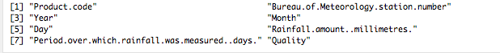

The standard process of renaming columns, removing columns and adding columns took place to make our data more efficient to work with. We also removed certain rows like 2016 because there was only half a years worth of data. We also removed the first 7 years of data as there were not values (which explains the 6%). We also removed leap years in the data set as they would cause problems later on.

There were a few N/A values missing in our data set which is to be expected as it is only 94% complete. These results may be missing for a number of reasons. A station may have been closed, reopened, upgraded to a full weather station or downgraded to a rainfall only station during its existence, resulting in breaks in the record for some or all elements. It is important to note that damaged instrumentation can result in gaps in the record for one (or more) meteorological element. In contrast the absence or illness of an observer may result in gaps in
the record for all elements at a particular site.

The Two State Markov Chain Model, which will be discussed further on, can be described as the day either being rainy (R) or dry (D) and that the probability of rain on a given day depends on whether or not rain occurred on the previous day. (Hasan and Dunn 2010). 

The Markov chain of daily rainfall can be examined to see if the events are independent of each other (null hypothesis) or dependent (alternative hypothesis). If dependent they are they can form a first order Markov. (Moon, Ryoo and Kwon 1994) i.e Two State Markov, using the previous day. 

With this in mind we needed to determine what constitutes as a ‘rainy’ and ‘wet’ day. This was done through information supplied by the BOM website, the same site we scraped our data from. From the table below we can conclude that a ‘dry day’ will be measured as < 0.1 mm and a ‘rainy day’ ≥ 0.1mm. ("Frequently Asked Questions: Climate Data" 2018)
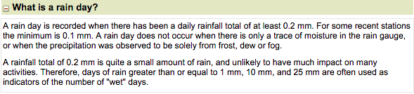

However it is important to note that some studies, have used up to 3mm as the threshold. One study in particular compared using 0.1mm, 1mm and 3mm in their analysis. They found that “depending on the threshold used to define wet and dry days indirectly affect the overall [transitional] probabilities” (Sonnadara and Jayewardene 2014)   

They concluded that the whatever threshold estimate you use acts as a scaling parameter. And that if thresholds are increased, the transitional probabilities would also increase accordingly (Sonnadara and Jayewardene 2014). It would be interesting to see what would happen if we changed our threshold value in our dataset. 

We finally created a column in our dataframe of 1s and 0s with a threshold of 0.1mm, along with the rest of our data. The final product looked like this. Refer to Appendix A for full cleaning and sourcing. 

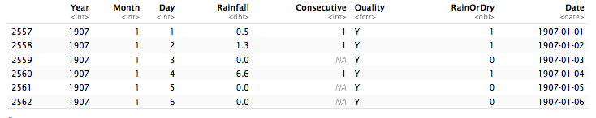

## Methodology 

#### Exploratory Data Analysis

The construction of our weather generator can be divided into two main processes. The first process involves the use of a first-order two-state markov chain to generate the patterns of wet and dry days. The second process is triggered when a simulated day is characterised as “wet”, after which an amount of rainfall is randomly generated from a probability distribution and assigned to that day. 

Prior to building the generator, it was necessary to decide how to divide the modelling process up in order to capture the seasonal variability in the observed rainfall data. For each seasonal period a set of transitional probabilities and distribution parameters must be estimated. The second step required before the model could be implemented, involved selecting an appropriate distribution from which the rainfall amounts would be drawn.

Perth, WA, exhibits a hot-summer Mediterranean climate (Koppen climate classification Csa), characterised by two main season, hot dry summers (approximately December through March) and mild wet winters (approximately May through September). Occasional extreme rainfall events in the summer months are also typical for the Perth region as tropical cyclones from the north-west travel south. Figure A below of observed data shows the distribution of wet days throughout the year for the 109 years of data collected from the Mundaring Weir. The seasonal variation is clear, with a large proportion of wet days observed during the winter months and scarcely distributed during the summer. 

Figure B displays the rainfall amounts recorded over the same period as a heatmap, with larger rainfall amounts shown as darker cells and extreme rainfall events highlighted in red. Given the total number of wet days, a notable number of extreme rainfall events can be seen to occur in the summer months, particularly around February, compared to the winter months.

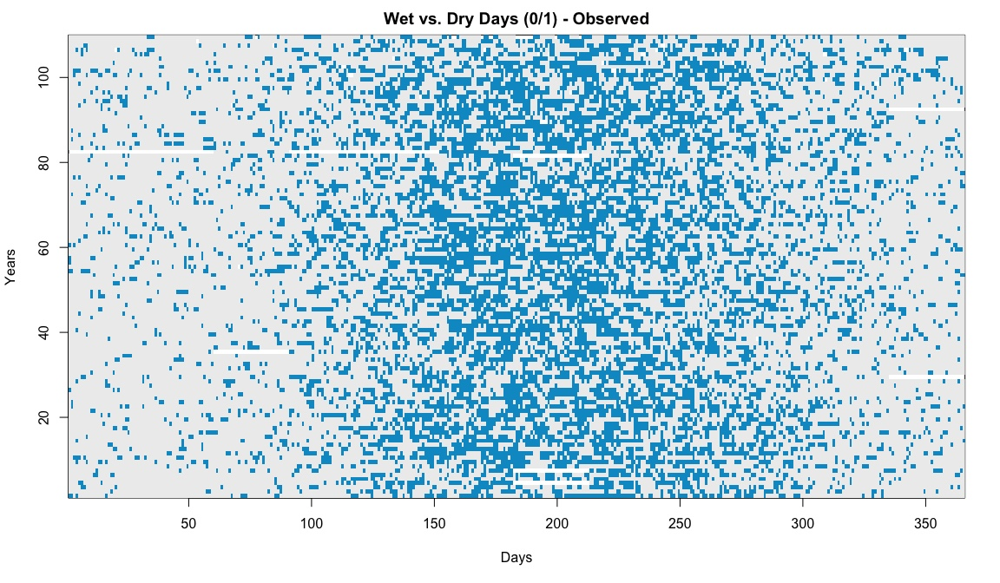 

**Fig. A:** 

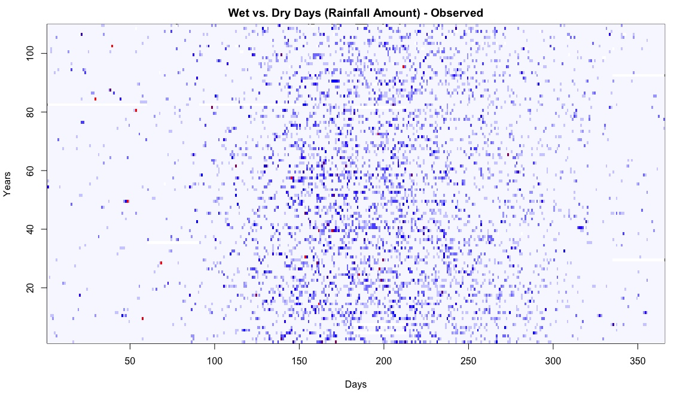 
**Fig. B:** 

Comparing the mean monthly rainfall over the recorded years (Figure c) highlights the seasonal trends previously described, and makes clearer the difference in rainfall amounts between each month. In order to define “seasons” for the weather generator it is important that the time-span encompassed by a season is characterised by similar rainfall pattern behaviour. To determine how similar neighbouring months were in terms of rainfall occurrence, and whether they could be reasonably grouped into “seasons”, transitional probabilities were estimated for each month from the combined dataset (see the appendix below for a detailed description of how the transitional probabilities are estimated) and compared. Figure d summarises this data, and as expected there is little difference in the transitional probabilities between the summer months (December to February) or the winter months (June to August). However, the months separating summer and winter exhibit relatively large differences when compared with each other as well as the summer and winter months. It was decided that attempting to divide the data into two seasons or even four seasons would result in a loss of information describing the true rainfall behaviour of the region. For this reason each month was treated as a separate “season” with a set of transitional probabilities and distribution parameters estimated and applied to the model when generating data for the corresponding month.

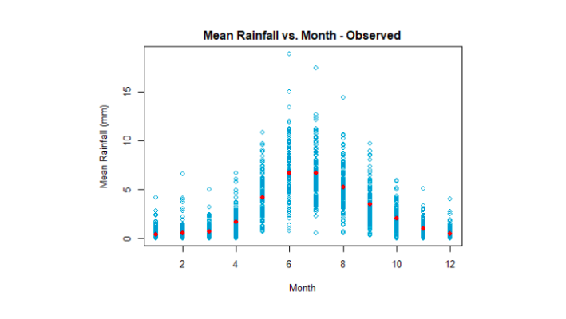 
**Fig. C:** 
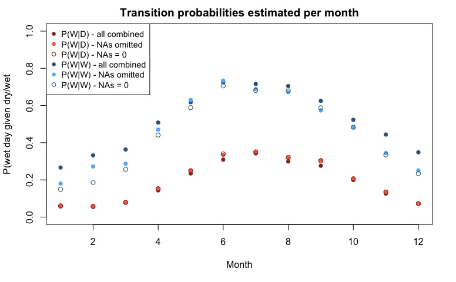 
**Fig. D:** 

#### Rainfall Distribution

To select a suitable probability distribution for generating the rainfall amount data, the functions “descdist()” and “fitdist()”, from the R package “fitdistrplus” were applied to the observed rainfall data. The former highlighted the gamma, log-normal and exponential distributions as potential candidates, each of which were proposed by other studies as suitable distributions for certain climates and locations. The second function compares the fit of the observed data against each of the the theoretical distributions created by simulating a large number of random variables from the respective distribution defined by parameters estimated from the observed data. Figure e compares the fit of the observed data against the data generated from the gamma, log-normal and exponential distributions.

While the performance is lost slightly for larger rainfall values (the Q-Q plot shows that the theoretical quantiles are underestimated compared to the real quantiles, for larger rainfall amounts), overall the gamma distribution provided the most consistent and close approximation of the observed data compared to the others. According to these findings, the gamma distribution was selected for generating the rainfall amounts in our model. Fig F and G show the outputs for the log-normal and exponential distribution, respectively.

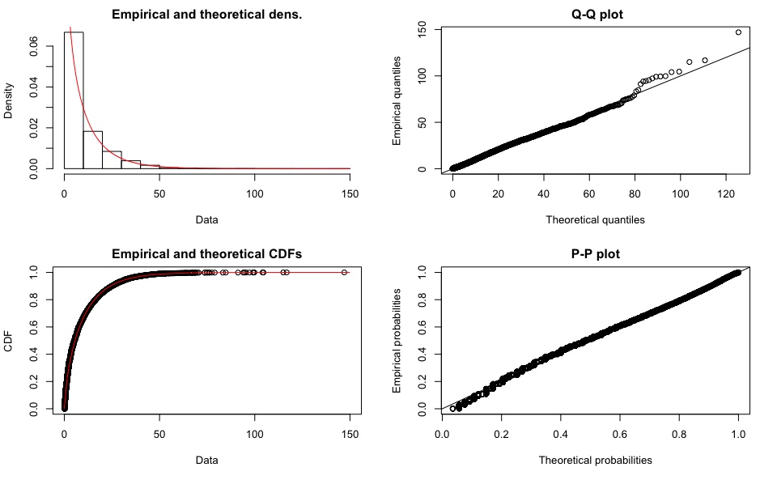 
**Fig. E:** 


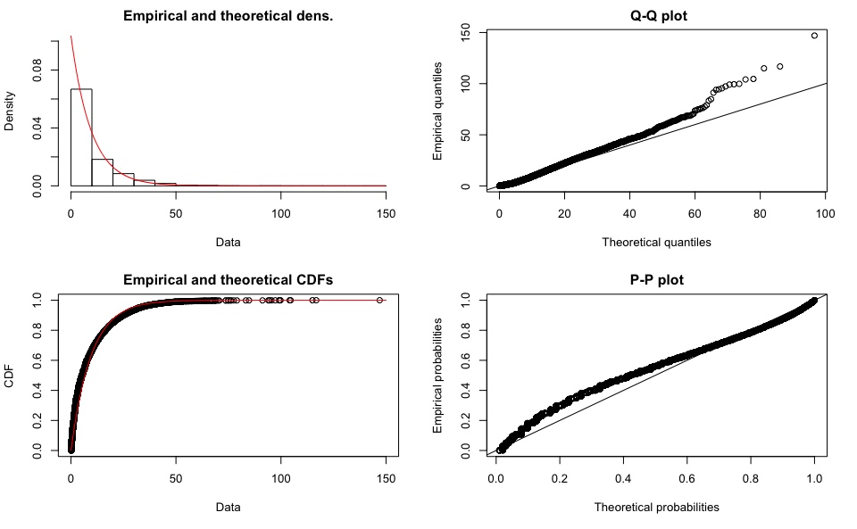 
**Fig. F:** 

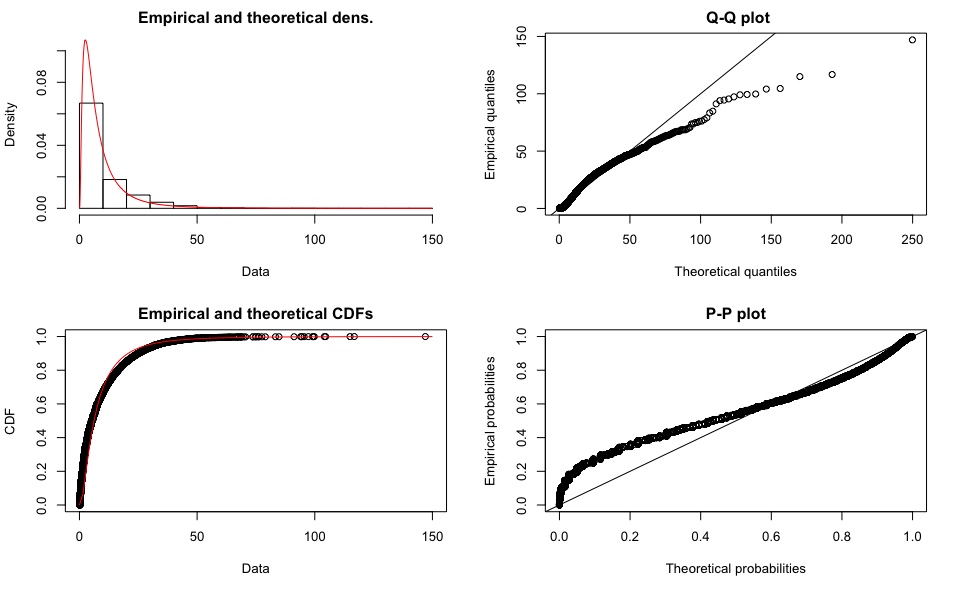 
**Fig. G:** 


#### Transition Probabilties 

To generate the patterns of wet and dry days a first-order two-state markov chain was employed. A first-order two-state markov chain is a statistical model that randomly generates a value assigned to one of two “states”, (in our case a “0” is assigned to the occurrence of a dry day and a “1” is assigned to the occurrence of a wet day), where the probability of each outcome is dependent of the “state” of the preceding element in the chain. That is, the probability that a given day will be wet will vary depending on whether the previous day was also wet or was instead dry. These probabilities are described as transitional probabilities and are estimated from historical observations. A two-state markov chain requires just two transitional probabilities to function, for simulating sequences of wet and dry days these probabilities are:

P0 = Probability of a wet day given that the previous day was dry = P(W|D), and
P1 = Probability of a wet day given that the previous day was wet = P(W|W)

These are estimated from the historical dataset according to the following:

P(W|D) = number of wet days preceded by a dry day / total number of dry days, and
P(W|W) = number of wet days precede by a wet day / total number of wet days

It is clear to see that the corresponding probabilities, P(D|D) and P(D|W) can be derived from the above as (1 - P0) and (1 - P1) respectively. 

Three methods for estimating the monthly transitional probabilities were compared. The first was to estimate the transitional probability of each month for each year and get the average for each month. Because it sometimes happened that an entire month would consist of only wet or only dry days, there were some months for which one of the probabilities could not be estimated and the other was calculated as either an absolute certainty (P = 1) or impossible (P = 0). To deal with this, in the first method all “NAs” (probabilities that could not be estimated) were converted to “0”, and the average probability was calculated for each month from the combined years probabilities. In the second method all “NAs” were omitted and the average probability was calculated from the remaining years probabilities. In the third method, the transitional probabilities were estimated from a combined chain of all the years data for each month, eliminating the occurrence of “NAs” entirely. By combining the data from all years and estimating a single set of probabilities it was unavoidable that data points would be treated as sequential when they were not, where the end of the month joins with the start of the following years month. Figure H shows the monthly transitional probabilities estimated via each of these methods.

 
**Fig. H:** 


For the P(W|D) there is almost no difference in the estimated monthly probabilities between the three methods. Similarly, there is very little difference between the estimates for the P(W|W) in the winter months, however, they do vary over the non-winter months November through March. The P(W|W) is estimated to be greater when the probabilities are estimated from the combined data compared with either of the averaging methods, with the lowest probabilities estimated when the NAs are replaced by zeros, as would be expected. By averaging the probabilities for each month separately, the result is single rain days in a month being “lost” as the probability that a wet day follows a wet day will come out to zero. Additionally, in the case where there were no wet days the resulting NA drags the probability down when it is replaced with a zero. In light of this, we proceeded to estimate the monthly transitional probabilities for our model via the third method described above, by combining the data from each month over all years and generating a single set of probabilities. This method was preferred as in most cases there was little difference between the estimates, and where there was, the chosen method eliminated the influence that removing or replacing data points had on the estimation. 

As an additional check to verify that our decision to estimate the transitional probabilities from the combined data was appropriate, we looked at the monthly probabilities over the 109 years looking for visible trends, such as an increase or decrease in probabilities over time. While individual months sometimes showed an overall upward or downward trend over time, the distribution of months that went up or down did not follow a seasonal pattern, varying month to month. The individual plots for each month can be seen in Appendix A, but Figure I combines the P(W|D) and P(W|W) for all months over all years into individual plots respectively. The darker points indicate the probabilities from the summer months and blue points indicate the probabilities from winter months. No evident trends exist over time so we conclude that by estimating the probabilities from a combined series of data, no critical rainfall behaviour will be lost when building our model.

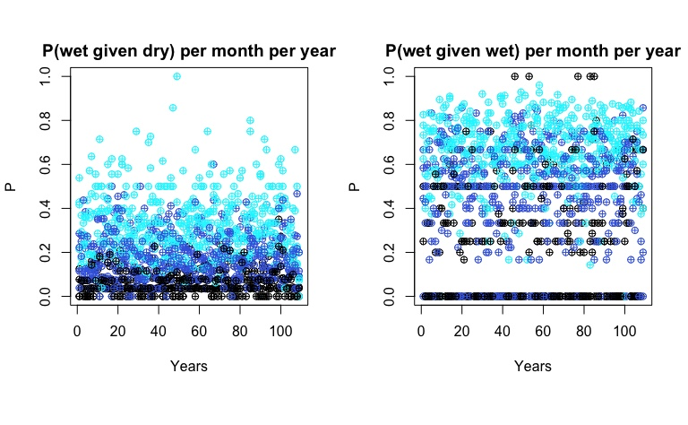 
**Fig. I:** 


#### Generating Markov Chains

Once the transitional probabilities have been estimated, generating a sequence of 1’s and 0’s, corresponding to wet and dry days respectively, is done via a simple loop that starts by checking the state of the $i-1th$ element, if it’s state is equal to 0 (i.e. a dry day), a single random binomial variable is drawn with a probability of “success” (success = 1 = wet day) equal to P(W|D) and the randomly generated binomial variable is assigned to element $i$ in the chain. If instead the i-1th element is equal to 1, then a single random binomial variable is drawn with a probability of success equal to P(W|W). The loop is repeated for  i = 1, 2, 3, …, n times where n is the length of the desired chain. The R code to implement the loop is shown in Figure J below.

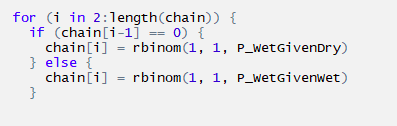 
**Fig. J:** 

To initiate the chain sequence, the state of the first element in the chain must be defined. As our model is designed to generate 12 individual chains, corresponding to the 12 months in a year, there are 12 instances where the initial value must be defined. The first initial value, January 1, must be defined for each new year. We added an additional component to our model that would draw a random binomial variable with a probability of success (wet day) equal to the overall probability for a wet day occuring on January 1 and set that variable as the initial value in the chain each time a new year is generated. From 108 records for January 1, 6 were wet days and 102 were dry days. This gives a total probability of $6/108 = 0.056$ or approximately 5.6% chance of a wet day on January 1. For each of the subsequent months, the first day is generated like normal, applying the transitional probabilities for the respective month but using the last element from the previous month as the initial $i-1th$ element.

#### Distribution of Rainfall

The second stage of the modelling process is to generate a rainfall amount for each wet day by drawing a random variate from a gamma distribution defined by parameters that have been estimated from the observed data. The gamma distribution takes two parameters, the alpha (shape), and beta (scale) parameters. Knowing the sample mean (mu) and variance (sigma^2), the two parameters can be estimated by method of moments according to the following formulae:

$Alpha = ( mu / sqrt(sigma^2) )^2$

$b = sigma^2/mu$

Mu and sigma^2 are calculated from the combined wet-day only rainfall data for each season over the 109 observed years. For each month the alpha and beta parameters are estimated and used to define the theoretical distribution from which the rainfall amounts are drawn. For each “wet day” generated by the markov chain, a random variable is drawn from the defined gamma distribution and assigned to that day in a second vector of rainfall amounts. The gamma function is contained within a loop which will continue to draw random variates until a value greater than or equal to 0.1 is generated. As 0.1 mm is the threshold for what constitutes a wet day, anything below this would be considered dry. Figure K shows the R code used to implement the rainfall amount generator for each wet day generated by the markov chain. 

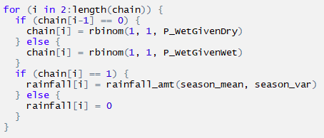 

**Fig. K:** 

Following the completion of our weather generator, a final set of simulated data was produced, spanning 109 years to match the temporal scale of the observed dataset. The two data series’ were compared to determine how well the simulated data modelled the observed data. To analyse the fit of the data, statistical summaries of the rainfall amounts and the wet and dry spell patterns were generated and compared. A good weather generator aims to reflect the natural variability that occurs over seasons and also generates extreme and rare events with a similar periodicity as seen in real observations. The main metrics used to compare how well our model performed were daily, monthly and annual rainfall means, monthly and annual maximums, rainfall amount quantiles and the mean and maximum length of wet and dry spells. 

## Results and Interpretation

#### Daily Rainfall 

Our simulated data consists of two matrices each covering 109 years of data, resulting in 39,785 data points (Days). The first vector contains wet and dry day 1s and 0s to represent the occurance of wet and dry days. The second matrix contains the rainfall amount values. Figure L shows the distribtuion of daily rainfall amounts for wet days only, for observed and simulated data. Broadly spekaing, the simualted data follows a similar distributional behaviour. However we can see that the simualted data does not reach the same maximum range as the oberved data and also under-represents values in the 1st quartile. Table 1 displays the quantiles for the daily rainfall amounts for wet days only. This further demonstartes the distributions are fairly similar with slight deviations within the first quantile and the maximum quantity.

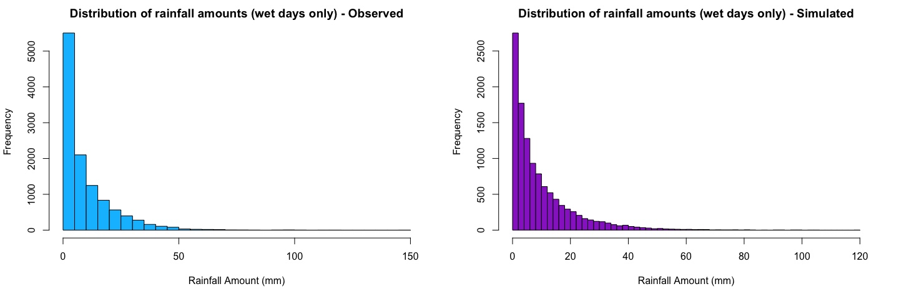 
**Fig. L:** 
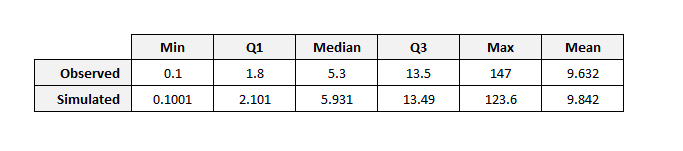 

The distributions of daily rainfall for wet days when plotted per month, show difference in the range and distribution following a seasonal trend. However, the overall behaviour of the distribution reflects that of the above plot with the simulated data underestimating maximums and underestimating the number of records within the first qunatile. Refer to Appendix for full set of plots. 

These figures below show the distribution of rainfall amounts, for every day over 109 years. With darker values represnting amounts of rainfall and the highest points marked in red, portraying extreme events. In our simulated data, we can see that the distribution of higher rainfall events, occur mainly in the winter seasons with more scarice but extreme rainfall events occuring in the summer. This is a goood approximation of the observed data, however, the same distributional trends as highlighted in the histograms above are observed by a larger amount of greater rainfall amounts evenly distributed throughout the year. 

 

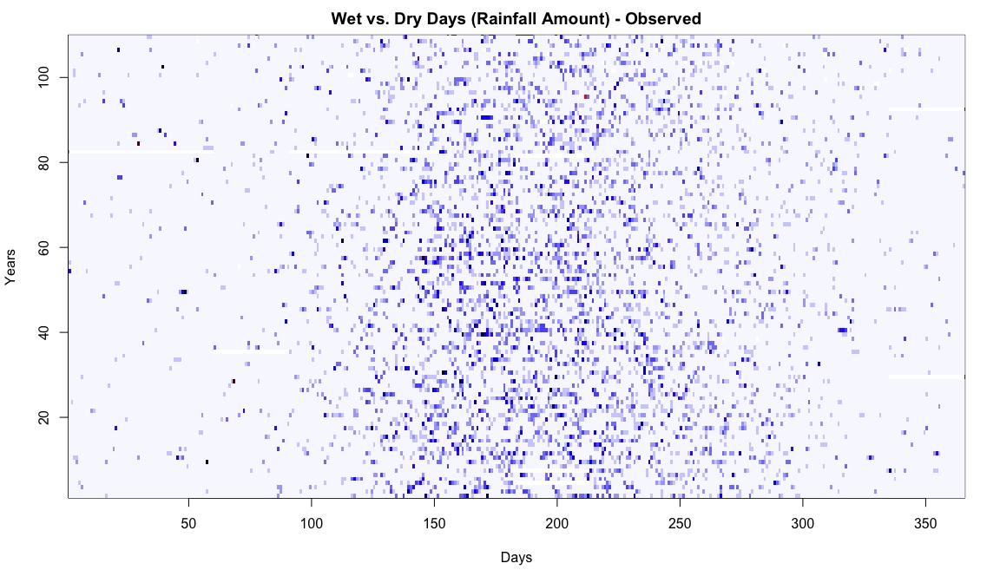 


#### Monthly Rainfall 

The comparison of monthly means, calculated per year, showcases a similar annual seasonal trend between observed and simulated data with the summer months characterised by low monthly means with little small spread and the winter months characterised by larger monthly means and wider spread values. Similarly the variance of monthly rainfall between observed and simulated data show a similar trend. Most noteably is the presence of outlying measures of variance in the summer months of the observed data, likely resulting from the extreme weather events. These outliers are reflected in the simulated data. 

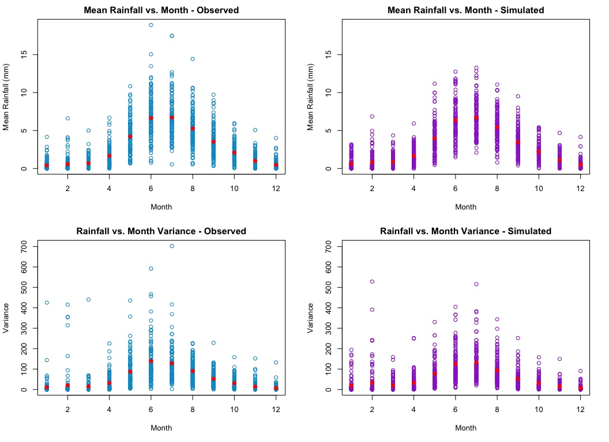 

Figure M summarises the overall monthly averages for all years in the observed and simulated data sets. The close fit of both simulated to observed values of each month shows that our simulated rainfall data may be consider a good approximation of the data when averged over a large number of years.


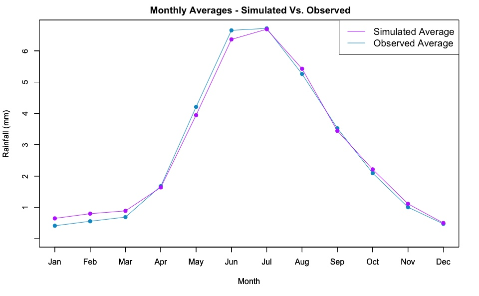 
**Fig. M:** 

Figure N summarises the overall maximums observed over each month of the entire data set. Again, the simulated maximums follow a similar trend but here we can see that the simulated data fails to reach the same extreme rainfall amounts that occur in the winter months. 


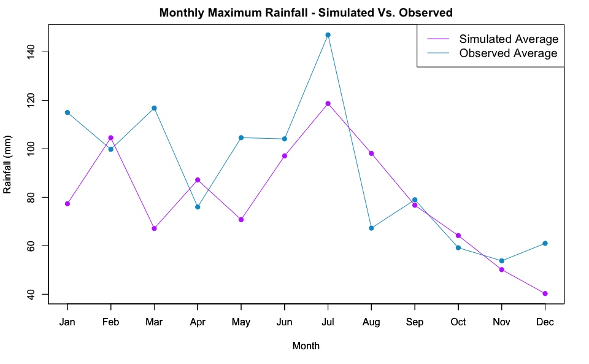 
**Fig. N:** 


#### Annual Rainfall 

A comparison of mean annual rainfall from 1907 to 2015 compared with 109 years of simulated data highlights the inabilty of our model to cpature what appears to be a downward trend in mean annual rainfall approximately strating in 1960 in the observed data. This apparent trend could not be replecated by our model as we estimated our distributional parameters from the mean and varainces calculated from the entire data set not allowing for a change in values over time. Furthermore the annual means of the simulated data, appear more concetrated around a central mean as opposed to the observd data set where large fluctuations in annual rainfall occur frequently between successive years. None the less, both the observed and simulated means fluctuate around 2.5 to 3 mm however this appears to deviate in the observed data approximately after 1960. 

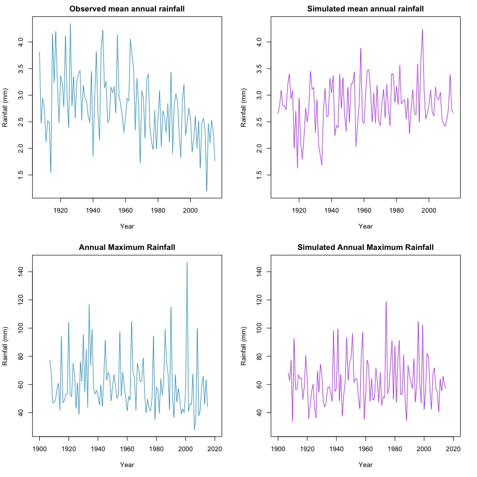 

Anuual maximum rainfall compare similarly to the annual means with simulated data showing less divergence compared to the observed data. However, both data sets tend to fluctuate around a shared central point. One might note that in our simulated data we see comparitive periods of low divergence compared to areas of higher divergence and these values are generated randomly. 


#### Wet and Dry Spells 

Wet and dry spells are defined as a series of consecutive chains of wet or dry days. Comparing the original heat map of 1s and 0s from observed data with the same image generated from our simulated data we can clearly see that the distribtuion of wet and dry days generated by our markov chain model resulted in a good approximation of the rainfall occurance patterns observed in the Mundaring Weir data set with the same concentration of rain days around the winter months and scaricely distributed rain days in the summer months. 


 

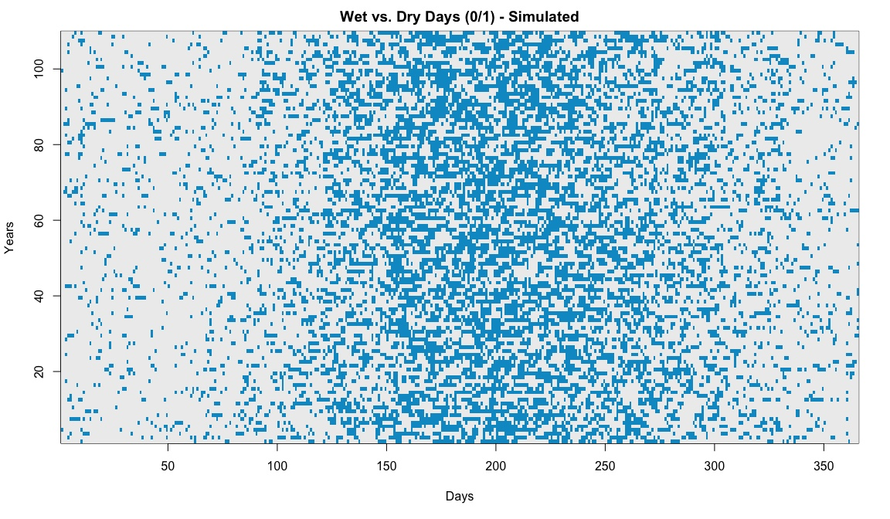 
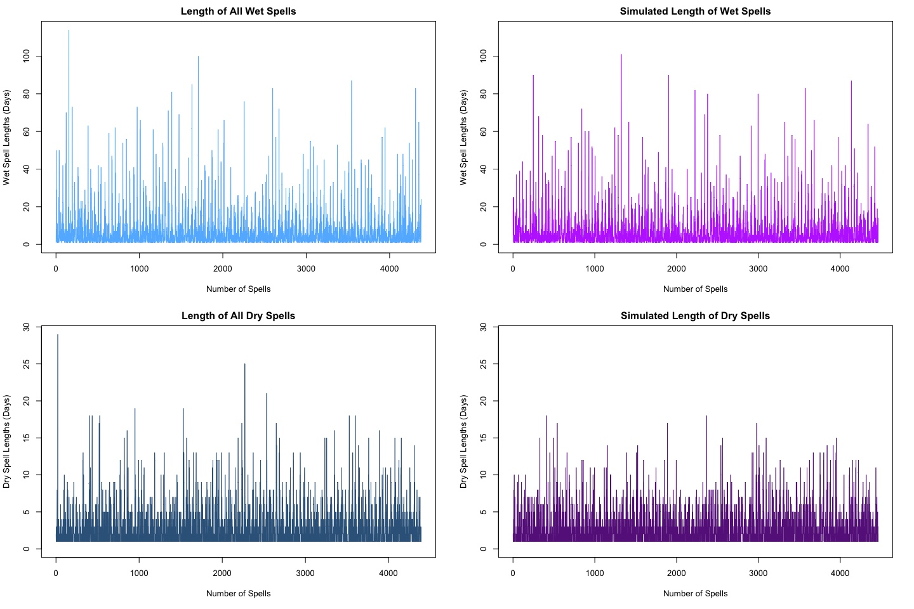 

The above figure further supports the successful fit of our model in terms of rainfall occurance as you can see the range and fluctuations in wet and dry spell lengths appear almost identical between observed and simulated data sets. The table below summarises the mean spell length, number of spells per year and maximum spell length for dry and wet spells between the observed and simulated data. We observe that the mean spell length for both wet and dry spell between the data sets are almost the same. Similarly the average number of spells per year is almost identical between all wet and dry spells. Slight discrepencies are observed between the obersved and simulated data set when comparing the maximum number of days in a wet or dry spell. The simulated dat under estimates the maximum number of days in a dry spell and in a wet spell. Despite this we find that our model successfully simulated rainfall occurance data reflecting the behaviour of that seen in the Mundaring Weir. 

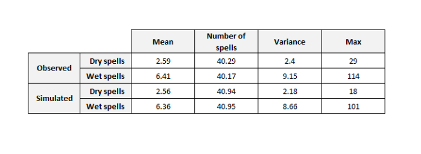 

## Discussion 

#### RAINFALL
The distribution of daily rainfall values for the entire series of wet days from the simulated data show a close approximate fit compared to the observed data. The distribution, supported by the quantiles, highlight where the model deviates from the observed data by underrepresenting the number of rainfall observations with small rainfall amounts, less that approximately 1.8mm. The simulated data also underrepresents the range of rainfall amounts seen in extreme events in the observed data. Overall, the fit of daily rainfall amounts reflects the observed values closely and supports the use of a gamma distribution for generating rainfall amounts.

The appropriateness of the gamma distribution is further demonstrated in the comparison of monthly means and variances, which follow the same seasonal trends as well as similar within-month variation. Worthy of note, is that our model succeeds in replicating the occurrence of particularly large variances in the summer months which characterise the observed dataset and may be attributed to the extreme rainfall events that happen when cyclones travel south from the Pilbara region in the summer.

Annual means begin to highlight the limitations of the model, the model generates data that fluctuates more evenly and compactly around a central line compared with the observed data which exhibits large fluctuations between consecutive years which diverge further from the central mean. Furthermore, there appears to be a downward trend in annual mean rainfall beginning approximately in the 1960s to the present. With a relatively short time-frame of data it is possible that this trend reflects are larger cyclic behaviour that was not captured by our model. Our model fails to replicate the observed trend as we did not make allowances for the distribution parameter estimates to change over time, hence the stability of our simulated data when averaged over larger periods of time like a year. Given the dry climate of the Perth region, this downward trend in annual rainfall is to be considered of significant importance in terms of urban planning, agriculture, environmental conservation and research and for future management of water resources. This trend may be reflective of the global phenomenon of climate change which is driving shifts in climate systems around the world, however such a conclusion requires significantly more advanced study and statistical modelling to support.

#### Wet and Dry Spells

The distribution of wet and dry spells generated by our markov chain fit extremely well to the patterns observed in the Mundaring Weir dataset and support the use of a single-order two-state markov chain to approximate the rainfall occurrence in this region. While the maximum number of days in both wet and dry spells were under-estimated by our model, the overall mean spell length and number of spells per year were almost an exact fit to the observed data.


## Conclusion 

Based on the findings of our investigation, we conclude that the use of a first-order two-state markov chain in combination with a gamma distribution for generating rainfall amounts can be successfully employed to generate artificial time-series of rainfall data that approximate real observations for the Mundaring Weir region.  

Improvements to our model might be considered by incorporating a covariate that would allow the estimates of the gamma parameters to shift over time, reflecting the downward trend in rainfall amounts observed in the real data set.


## References

Husak, G. J., J. Michaelsen and C. Funk. 2006. “Use of the gamma distribution to represent monthly rainfall in Africa for drought monitoring applications.” INTERNATIONAL JOURNAL OF CLIMATOLOGY 27: 935-944. 10.1002/joc.1441
 
Dikko, H.G. 2013. “Modeling the Distribution of Rainfall Intensity using Quarterly Data.” IOSR Journal of Mathematics. 9. 11-16. 10.9790/5728-0911116

"Frequently Asked Questions: Climate Data". 2018. Bom.Gov.Au. http://www.bom.gov.au/climate/how/faq-data.shtml.

Sonnadara, D. U. J., and D. R. Jayewardene. 2014. "A Markov Chain Probability Model To Describe Wet And Dry Patterns Of Weather At Colombo". Theoretical And Applied Climatology 119 (1-2): 333-340. doi:10.1007/s00704-014-1117-z.


### __Appendix A__


```{r}
# Importing and cleaning the data

#Import file
data = read.csv("MundaringWeirData.csv") 

#Rename Columns
colnames(data)[6] <- "Rainfall"
colnames(data)[7] <- "Consecutive"

#Remove  columns 
data_clean <- data[,3:8]

#Remove first 6 years (no data collected)
DataWeir <- data_clean[2557:42489,]


#Remove 2016 because not a full year
DataWeir <- DataWeir[which(DataWeir$Year != 2016), ]

#Duplicate rainfall column 
DataWeir$RainOrDry <- DataWeir$Rainfall

#Make column one or zero for rainy or dry 
DataWeir$RainOrDry[DataWeir$RainOrDry<0.1] <- 0
DataWeir$RainOrDry[DataWeir$RainOrDry>=0.1] <- 1

#Find what rainfall is N/A to change
Which.NA <- which(is.na(DataWeir$Rainfall)) #change from "new" to "DataWeir" and "Rainfall.mm" to "Rainfall"

#Moved to after the conversion because otherwise all 4s gets changed to "1" (>0.1)
#Make all N/As an integer (4)
DataWeir$RainOrDry[is.na(DataWeir$RainOrDry)] <- 4 #changed so only N/A in rainfall col is changed

#Check that Which.NA is equal to "Which.4"
all(Which.NA == which(DataWeir$RainOrDry == "4"))

#adding new date column (combined)
DataWeir$Date <- as.Date(with(DataWeir, paste(Year, Month, Day , sep = "-")), "%Y -%m -%d")

#index values for feb29s
feb29s <- (which(DataWeir$Month == "2" & DataWeir$Day == "29"))

#year of leap years
leaps <- DataWeir$Year[feb29s]

#dataset with feb29s removed
DataWeir_noleaps <- DataWeir[-c(feb29s), ]

#matrix of rainfall amount with leapyears removed
rain_noleaps <- matrix(DataWeir$Rainfall[-c(feb29s)], ncol = 365, byrow = TRUE)
wetday_noleaps <- matrix(DataWeir$RainOrDry[-c(feb29s)], ncol = 365, byrow = TRUE)

#vector of all years
years <- unique(DataWeir$Year)

```


## __Appendix B__

### Markov Chain


```{r}

trans_probs <- function(wetdryseq){
  #CALCULATE TRANSITION PROBABILITIES FOR A GIVEN SEQUENCE
  
  #INPUT:
  #wetdryseq = sequence of 1,0,4s 1 = wet, 0 = dry, 4 = NA
  
  #OUTPUT:
  #probs = transition probabilities vector, probs[1] = P_WgD, probs[2] = P_WgW
  
  t_len <- length(wetdryseq)-1
  trans_vector <- c(1:t_len)
  
  for (i in 1:t_len) {
    if (wetdryseq[i] == 0) {
      if (wetdryseq[i+1] == 0) {
        trans_vector[i] <- "DgD"
      } else if (wetdryseq[i+1] == 1) {
        trans_vector[i] <- "WgD"
      } 
    } else if (wetdryseq[i] == 1) {
      if (wetdryseq[i+1] == 1) {
        trans_vector[i] <- "WgW"
      } else if (wetdryseq[i+1] == 0) {
        trans_vector[i] <- "DgW"
      }
    }
  }
  
  len_wgd <- length(which(trans_vector == "WgD"))
  len_wgw <- length(which(trans_vector == "WgW"))
  
  P_wgd <- len_wgd / (length(which(trans_vector == "DgD")) + len_wgd)
  P_wgw <- len_wgw / (length(which(trans_vector == "DgW")) + len_wgw)
  
  probs <- c(P_wgd, P_wgw)
  
  return(probs)
}

```

```{r}

P_perseason <- function(data, index){
  #CALCULATE TRANSITION PROBABILITIES FOR DEFINED SEASONS
  
  #INPUT:
  #data = a sequence of rainfall occurance data
  #index = vector of index's at which to split each sequence by season (first element must be 0 and last must be length(data))
  
  #OUTPUT:
  #listout = list of two vectors, listout[1] =  P(wet|dry), listout[2] =  P(wet|wet). 
  #          Each element represents the probability per season 
  
  wgd <- c(1:((length(index)-1)))
  wgw <- c(1:((length(index)-1)))
  
  for (i in 1:(length(index)-1)){
    season_data <- data[(index[i]+1):(index[i+1])]
    wgd[i] <- trans_probs(season_data)[1]
    wgw[i] <- trans_probs(season_data)[2]
  }

  listout = list(wgd, wgw)
  return(listout)
}

```

```{r}

P_perseason_peryear <- function(mat, index){
  #GENERATE MATRIX OF SEASONAL TRANSITION PROBABILITIES FOR MULTIPLE YEARS
  
  #INPUT:
  #mat = matrix of rainfall occurance data, one year per row
  #index = vector of index's at which to split each sequence by season (first element must be 0 and last must be length(data))
  
  #OUTPUT:
  #listout = list of two matricies, listout[1] = P(wet|dry), listout[2] = P(wet|wet).
  #          Each element represents the probability per season per year
  
  tempdata = rep(NaN, (nrow(mat))*(length(index)-1))
  wgd = array(tempdata, c((nrow(mat)), ((length(index)-1))))
  wgw = array(tempdata, c((nrow(mat)), ((length(index)-1))))
  
  for(i in 1:nrow(mat)){
    temprow = mat[i, ]
    wgd[i, ] = P_perseason(temprow, index)[[1]]
    wgw[i, ] = P_perseason(temprow, index)[[2]]
  }
  
  ##REPLACE NaNs WITH ZEROS
  #wgd[is.na(wgd)] <- 0
  #wgw[is.na(wgw)] <- 0
  
  listout = list(wgd, wgw)
  return(listout)
}

```

```{r}
#CALCULATE INDEX FOR MONTHLY "SEASONS"
dayspermonth <- as.numeric(c(31, 28, 31, 30, 31, 30, 31, 31, 30, 31, 30, 31))
cumdays <- c(0, cumsum(dayspermonth))

#GENERATE TRANSITION PROBABILITIES FOR EACH MONTH BY AVERAGING THE PER-MONTH PROBABILITES OVER ALL YEARS
#Replace NAs with P = 0, occurs when transition prob can't be calculated due to entire month of only wet or only dry days
wgd_average <- P_perseason_peryear(wetday_noleaps, cumdays)[[1]]
wgd_average[is.na(wgd_average)] <- 0
wgd_average <- colMeans(wgd_average)

wgw_average <- P_perseason_peryear(wetday_noleaps, cumdays)[[2]]
wgw_average[is.na(wgw_average)] <- 0
wgw_average <- colMeans(wgw_average)

#Omit NAs completely
wgd_av_omit <- colMeans(na.omit(P_perseason_peryear(wetday_noleaps, cumdays)[[1]]))
wgw_av_omit <- colMeans(na.omit(P_perseason_peryear(wetday_noleaps, cumdays)[[2]]))

#GENERATE TRANSITION PROBABILITIES FOR EACH MONTH BY COMBINING EACH MONTH FOR ALL YEARS INTO A SINGLE SEQUENCE
P_all <- (array(data = rep(NaN, 12*2), dim = c(12,2)))
for (i in 1:12) {
  P_all[i, ] = trans_probs(as.vector(t( wetday_noleaps[, (cumdays[i]+1):(cumdays[i+1])])))
}

#MATRICIES OF PROBABILITES CALC'D ABOVE
P_average <- matrix(c(wgd_average, wgw_average),
                    nrow = 12, byrow = FALSE,
                    dimnames = list(c(1:12), c("WgD", "WgW")))

P_av_omit <- matrix(c(wgd_av_omit, wgw_av_omit),
                    nrow = 12, byrow = FALSE,
                    dimnames = list(c(1:12), c("WgD", "WgW")))

P_all <- matrix(P_all, dimnames = list(c(1:12), c("WgD", "WgW")),
                nrow = 12, byrow = FALSE)

#P_average; P_av_omit; P_all
```

```{r fig.height=5}
## WHOLE DATASET PROBS
matplot(P_all, pch = 16, col = c("tomato4", "steelblue4"), 
        ylab = "P(wet day given dry/wet", xlab = "Month",
        main = "Transition probabilities estimated per month", ylim = c(0,1))
points(P_av_omit[, 1], pch = 16, col = c("tomato1"))
points(P_av_omit[, 2], pch = 16, col = c("steelblue1"))
points(P_average[, 1], pch = 1, col = c("tomato4"))
points(P_average[, 2], pch = 1, col = c("steelblue4"))

legend("topleft", legend = c("P(W|D) - all combined", "P(W|D) - NAs omitted", 
                              "P(W|D) - NAs = 0", "P(W|W) - all combined",
                              "P(W|W) - NAs omitted", "P(W|W) - NAs = 0"), 
       col = c("tomato4", 'tomato1', "tomato4", "steelblue4", 
               "steelblue1", "steelblue4"), pch = c(16, 16, 1), cex=0.9)
```

## RAINFALL SUMMARY
```{r}
rain_sums <- function(season_days, data_mat) {
  #CALCULATE MEAN AND VAR FOR GIVEN SEASON OVER MULTIPLE YEARS
  
  #INPUT:
  #season_days = vector of number of days per season
  #data_mat = matrix of rainfall data, each year per row
  
  #OUTPUT:
  #matout = matrix with mean and variance of rainfall for defined season, each season per row
  
  cumdays = c(0, cumsum(season_days))
  rain_av = c(1:length(season_days))
  rain_var = c(1:length(season_days))
  
  
  for (i in 1:length(season_days)) {
    tempdata = as.vector(data_mat[, (cumdays[i]+1):(cumdays[i+1])])
    
    rain_av[i] = mean(na.omit(tempdata[which(tempdata>=0.1)]))
    rain_var[i] = var(na.omit(tempdata[which(tempdata>=0.1)]))
  }
  
  matout = matrix(c(rain_av, rain_var), nrow = length(season_days), byrow = FALSE, 
                  dimnames = list(c(1:length(season_days)), c("mean", "var")))
  return(matout)
}

```


## GAMMA DISTRIBUTION
```{r}

rain_amount <- function(sums) {
  #GENERATE A RANDOM VARIABLE FROM GAMMA DIST FOR GIVEN SEASON PARAMETERS
  
  #INPUT:
  #sums = list with mean and var sums[1] = mean, sums[2] = var
  
  #OUTPUT:
  #random variable from gamma distribution
  
  sh =  ((sums[[1]])/(sqrt(sums[[2]])))^2
  sc =  ((sums[[2]])/(sums[[1]]))

  flag = TRUE
  
  while (flag == TRUE) {
    r = rgamma(n = 1, shape = sh, scale = sc)
    
    if (r < 0.1) {
      flag = TRUE
    } else {
      flag = FALSE
    }
  }
  
  return(r)
}

```


## MARKOV CHAIN
```{r}

markov <- function(tp, len, t, rain) {
  #MARKOV CHAIN SIMULATOR
  
  #INPUT:
  #tp = seasonal transition probabilities tp[1] = prob of wet given dry, tp[2] = prob of wet given wet
  #len = number of days to simulate
  #t = starting value of the chain
  #rain = mean and var of rainfall for corresponding season
  
  #OUTPUT:
  #chainlist = markov chain of 1s (wet day) and 0s (dry day) of length = length
  
  chain_wetdry = c(1:len)
  chain_rain = c(1:len)
  
  chain_wetdry[1] = t
  
  if (chain_wetdry[1] == 1) {
    chain_rain[1] = rain_amount(rain)
  } else {
    chain_rain[1] = 0
  }
  
  
  for (i in 2:len) {
    if (chain_wetdry[i-1] == 0) {
      chain_wetdry[i] = rbinom(1, 1, tp[[1]])
    } else {
      chain_wetdry[i] = rbinom(1, 1, tp[[2]])
    }
    if (chain_wetdry[i] == 1) {
      chain_rain[i] = rain_amount(rain)
    } else {
      chain_rain[i] = 0
    }
  }
  
  chainlist = list(chain_wetdry, chain_rain)
  
  return(chainlist)
}

```

```{r}
#PROBABILITY OF A DRY DAY ON JAN 1 (BASED ON ALL JAN 1 IN DATASET)

jan1 <- c( wetday_noleaps[, 1])
jan1 <- replace(jan1, list = which(jan1 == "4"), values = NA)

1 - mean(na.omit(jan1))

#~0.944 therefore, start sequence with a 0, dry day
```

```{r}
markov_year <- function(P_mat, days, t, rain) {
  #GENERATE A MARKOV CHAIN FOR A YEAR WITH MULTIPLE SEASONS
  
  #INPUT:
  #t = first value in seq
  #p_mat = matrix of transition probs for each season
  #days = vector of number of days in each season
  #rain = matrix of mean and var for each season, season per row
  
  #OUTPUT:
  #yearlist = list with two vectors, one sequence of wet and dry days, one seq of rainfall amounts
  
  cumdays = c(0, (cumsum(days)))
  
  chain_wetdry = c()
  chain_rain = c()
  
  first_seq = markov(P_mat[1,], days[1], t, rain[1, ])
  
  chain_wetdry = c(first_seq[[1]])
  chain_rain = c(first_seq[[2]])
  
  for (i in 2:(length(days))) {
    t_new = markov(P_mat[i,], 2, tail(chain_wetdry, 1), rain[i, ])[[1]][2] ####
    season_len = days[i]
    new_seq = markov(P_mat[i,], season_len, t_new, rain[i, ])
    
    chain_wetdry = c(chain_wetdry, c(new_seq[[1]]))
    chain_rain = c(chain_rain, c(new_seq[[2]]))
  }
  
  yearlist = list(chain_wetdry, chain_rain)
  
  if (length(chain_wetdry) == tail(cumdays, 1)) {
    return(yearlist)
  } else {
    print("error generating markov chain")
  }
}
```

```{r}
markov_manyyear <- function(prob_matrix, season_days, numyear, rainfall_sums) {
  #GENERATE INDEPENDENT MARKOV CHAINS FOR MULTIPLE YEARS
  
    #INPUT:
  #t_0 = first value in seq
  #prob_matrix = matrix of transition probs for each season
  #season_days = vector of number of days in each season
  #numyears = number of years to generate
  #rainfall_sums = matrix of mean and var for each defined season (season per row)
  
  #OUTPUT:
  #ultimatelist = list of two arrays, one of rainfall occurance and one with raindall amounts
  
  somedata <- rep(NaN, numyear*(tail(cumsum(season_days), 1)))
  manychain_wetdry = array(somedata, c(numyear, (tail(cumsum(season_days), 1))))
  manychain_rain = array(somedata, c(numyear, (tail(cumsum(season_days), 1))))
  
  for (i in 1:numyear) {
    t_0 = rbinom(1, 1, 0.06) #Generate wet/dry day for jan 1
    yearall = markov_year(prob_matrix, season_days, t_0, rainfall_sums)
    manychain_wetdry[i, ] = yearall[[1]]
    manychain_rain[i, ] = yearall[[2]]
  }
  
  ultimatelist = list(manychain_wetdry, manychain_rain)
  
  return(ultimatelist)
  
}
```

```{r}
#109 years of rainfall occurance data generated by Markov chain
rainfall_summaries <- rain_sums(dayspermonth, rain_noleaps)
sim_data <- markov_manyyear(P_all, dayspermonth, 109, rainfall_summaries)
```


## __Appendix C__

```{r, fig.height=7, fig.width=12}


#heatmap of wet and dry days

#matrix with "4" replaced with NA
colourmap_wetdry <- c(wetday_noleaps)
colourmap_wetdry <- replace(colourmap_wetdry, list = which(colourmap_wetdry == "4"), values = NA)
colourmap_wetdry <- matrix(colourmap_wetdry, ncol = 365)

#Plot heatmap for observed data
image(x = c(1:366), y = c(1:110), z = t(colourmap_wetdry), 
      col = c("Grey93", "deepskyblue3"), xlab = "Days", 
      ylab = "Years", main = "Wet vs. Dry Days (0/1) - Observed")

#Plot heatmap for simulated data
image(x = c(1:366), y = c(1:110), z = t(sim_data[[1]]), 
      col = c("Grey93", "deepskyblue3"), xlab = "Days", 
      ylab = "Years", main = "Wet vs. Dry Days (0/1) - Simulated")

```

```{r, fig.height=7, fig.width=12}

colfunc4 <- colorRampPalette(c("ghostwhite", "blue", "black", "red"))

#heat map of rainfall amount

#Heatmap for observed data
image(x = c(1:366), y = c(1:110), z = t(rain_noleaps), col = colfunc4(20), 
      xlab = "Days", ylab = "Years", main = "Wet vs. Dry Days (Rainfall Amount) - Observed")

#Heatmap for simulated data
image(x = c(1:366), y = c(1:110), z = t(sim_data[[2]]), col = colfunc4(20), 
      xlab = "Days", ylab = "Years", main = "Wet vs. Dry Days (Rainfall Amount) - Simulated")
```

## Transition Probabilities - CALCULATED FROM OBSERVED DATA

```{r}
#LIST OF TRANSITION PROBABILITIES FOR EACH MONTH FOR EACH YEAR

P_permon_peryr <- P_perseason_peryear(wetday_noleaps, cumdays) 
```

```{r}
#COLOUR PALETTE

colfunc5 <- colorRampPalette(c("black", "black", "black", "royalblue", "royalblue", "turquoise1", "turquoise1", "turquoise1", "turquoise1", "royalblue", "royalblue", "black"))

#MONTH VECTOR
cmonth <- c("Jan", "Feb", "Mar", "Apr", "May", "Jun", "Jul", "Aug", "Sep", "Oct", "Nov", "Dec")
```

```{r, fig.width=10}
#TRANITION PROBABILITY - WET DAY GIVEN THE PREVIOUS DAY WAS DRY FOR EACH MONTH OVER TIME

par(mfrow = c(2,3))

WgD_peryear <- function(x){

  m <- as.vector(P_permon_peryr[[1]][, x])
  
  par(pty = "s")
  plot(years, m, type='p', xlab='Years', ylab='P', pch = 16, 
       main = paste("P(wet day given a dry day) -", cmonth[x]))
  abline(lm(m ~ years))
}
mapply(c(1:12), FUN = WgD_peryear)
```

```{r fig.width= 10, fig.height=5}
#TRANITION PROBABILITY - WET DAY GIVEN THE PREVIOUS DAY WAS DRY FOR EACH MONTH OVER TIME

par(mfrow = c(2,3))
WgD_hist <- function(x){
  m <- as.vector(P_permon_peryr[[1]][, x])
  
  hist(m, breaks = 20, 
       main = paste("P(wet day given a dry day) -", cmonth[x]), 
       col = 'deepskyblue3', xlab = "P(wet given dry)", xlim = c(0, 1), ylim = c(0, 35))
}
mapply(c(1:12), FUN = WgD_hist)
```

```{r fig.width=10}
#TRANITION PROBABILITY - WET DAY GIVEN THE PREVIOUS DAY WAS WET FOR EACH MONTH OVER TIME

par(mfrow = c(2,3))

WgW_peryear <- function(x){
  
  m <- as.vector((P_permon_peryr[[2]][, x]))
  
  par(pty = "s")
  plot(years, m, type='p', xlab='Years', ylab='P', pch = 16, 
       main = paste("P(wet day given a wet day) -", cmonth[x]))
  abline(lm(m ~ years))

}
mapply(c(1:12), FUN = WgW_peryear)
```

```{r fig.width= 10, fig.height=5}
#TRANITION PROBABILITY - WET DAY GIVEN THE PREVIOUS DAY WAS WET FOR EACH MONTH OVER TIME

par(mfrow = c(2,3))
WgW_hist <- function(x){
  
  m <- as.vector(P_permon_peryr[[2]][, x])
  
  hist(m, breaks = 20, 
       main = paste("P(wet day given a wet day) -", cmonth[x]), 
       col = 'deepskyblue3', xlab = "P(wet given dry)", xlim = c(0, 1), ylim = c(0, 45))
}
mapply(c(1:12), FUN = WgW_hist)
```

```{r fig.width=8}
#TRANSITION PROBABILITIES FOR ALL MONTHS OVER ALL YEARS
#BLACK = "SUMMER" MONTHS
#BLUE = "WINTER" MONTHS

par(mfrow = c(1,2))
par(pty = "s")
matplot(P_permon_peryr[[1]], type='p', xlab='Years', ylab='P', 
        col = (colfunc5(12)), pch = 10, main = "P(wet given dry) per month per year")

matplot(P_permon_peryr[[2]], type='p', xlab='Years', ylab='P', 
        col = (colfunc5(12)), pch = 10, main = "P(wet given wet) per month per year")
```


## DISTRIBUTIONS

```{r}
#hist of all rain 
hist(DataWeir$Rainfall[which(DataWeir$RainOrDry == 1)], breaks = 50, 
     main = "Histogram of all percipitation over all months", 
     col = 'blue', xlab  = "Rainfall Amount")
```

```{r fig.width=10}
#FITTING POTENTIAL DISTRIBUTIONS

rain_nodrydays <- (c(na.omit(rain_noleaps[which(rain_noleaps>=0.1)])))
descdist(rain_nodrydays)
```

```{r fig.width=10}
gamma <- fitdist(rain_nodrydays, "gamma", method = "mme")
plot(gamma)
lnorm <- fitdist(rain_nodrydays, "lnorm", method = "mme")
plot(lnorm)
exp <- fitdist(rain_nodrydays, "exp")
plot(exp)
```

## RAINFALL SUMMARIES

```{r}
#RAINFALL MEAN AND VARIANCE FOR OBSERVED DATA

mean_permonth_peryear <- array((rep(NaN, 109*12)), c(109,12))
var_permonth_peryear <- array((rep(NaN, 109*12)), c(109,12))

for (i in 1:109){
  for (j in 1:12){
    mean_permonth_peryear[i, j] = mean(na.omit(rain_noleaps[i, (cumdays[j]+1):(cumdays[j+1])]))
    var_permonth_peryear[i, j] = var(na.omit(rain_noleaps[i, (cumdays[j]+1):(cumdays[j+1])]))
  }
}

mean_permonth_all <- array(NaN, c(1, 12))
var_permonth_all <- array(NaN, c(1, 12))


for (i in 1:12){
  monthall = c()
  for (j in 1:109){
    new =  rain_noleaps[j, (cumdays[i]+1):(cumdays[i+1])]
    monthall = c(monthall, new)
  }
  mean_permonth_all[i] = mean(na.omit(monthall))
  var_permonth_all[i] = var(na.omit(monthall))
}


mean_ofmeans <- colMeans(na.omit(mean_permonth_peryear))
mean_ofvars <- colMeans(na.omit(var_permonth_peryear))
```

```{r}
#RAINFALL MEAN AND VARIANCE FOR SIMULATED DATA

mean_permonth_peryear2 <- array((rep(NaN, 109*12)), c(109,12))
var_permonth_peryear2 <- array((rep(NaN, 109*12)), c(109,12))

for (i in 1:109){
  for (j in 1:12){
    mean_permonth_peryear2[i, j] = mean(na.omit(sim_data[[2]][i, (cumdays[j]+1):(cumdays[j+1])]))
    var_permonth_peryear2[i, j] = var(na.omit(sim_data[[2]][i, (cumdays[j]+1):(cumdays[j+1])]))
  }
}

mean_permonth_all2 <- array(NaN, c(1, 12))
var_permonth_all2 <- array(NaN, c(1, 12))


for (i in 1:12){
  monthall = c()
  for (j in 1:109){
    new = sim_data[[2]][j, (cumdays[i]+1):(cumdays[i+1])]
    monthall = c(monthall, new)
  }
  mean_permonth_all2[i] = mean(na.omit(monthall))
  var_permonth_all2[i] = var(na.omit(monthall))
}
```

```{r, fig.width=11, fig.height=8}
par(mfrow = c(2,2))

limit8 <- range(0, max(c(na.omit(mean_permonth_peryear), na.omit(mean_permonth_peryear2))))
limit9 <- range(0, max(c(na.omit(var_permonth_peryear), na.omit(var_permonth_peryear2))))

matplot(t(mean_permonth_peryear), type = "p", pch = 1, col = "deepskyblue3", 
        xlab = "Month", ylab = "Mean Rainfall (mm)", 
        main = 'Mean Rainfall vs. Month - Observed', ylim = limit8)
points(t(mean_permonth_all), col = "red", pch = 19)

matplot(t(mean_permonth_peryear2), type = "p", pch = 1, col = "darkorchid", 
        xlab = "Month", ylab = "Mean Rainfall (mm)", 
        main = 'Mean Rainfall vs. Month - Simulated', ylim = limit8)
points(t(mean_permonth_all2), col = "red", pch = 19)


matplot(t(var_permonth_peryear), type = "p", pch = 1, col = "deepskyblue3", 
        xlab = "Month", ylab = "Variance", 
        main = 'Rainfall vs. Month Variance - Observed', ylim = limit9)
points(t(var_permonth_all), col = "red", pch = 19)

matplot(t(var_permonth_peryear2), type = "p", pch = 1, col = "darkorchid", 
        xlab = "Month", ylab = "Variance", 
        main = 'Rainfall vs. Month Variance - Simulated', ylim = limit9)
points(t(var_permonth_all2), col = "red", pch = 19)

```

```{r fig.width=15, fig.height=5}
#HISTOGRAMS OF RAINFALL AMOUNTS FOR OBSERVED AND SIMULATED DATASETS
#WET AND DRY DAYS

par(mfrow = c(1,2))

hist(as.vector(rain_noleaps), breaks = 50, 
     main = 'Distribution of rainfall amounts (all days) - Observed', 
     col = "deepskyblue" , xlab = "Rainfall Amount (mm)")

hist(as.vector(sim_data[[2]]), breaks = 50, 
     main = 'Distribution of rainfall amounts (all days)- Simulated', 
     col = "darkorchid", xlab = "Rainfall Amount (mm)")

```

```{r fig.width=15, fig.height=5}
#HISTOGRAMS OF RAINFALL AMOUNTS FOR OBSERVED AND SIMULATED DATASETS
#WET DAYS ONLY

par(mfrow = c(1,2))

hist(as.vector(rain_noleaps[which(rain_noleaps>0)]), breaks = 50, 
     main = 'Distribution of rainfall amounts (wet days only) - Observed', 
     col = "deepskyblue" , xlab = "Rainfall Amount (mm)")

hist(as.vector(sim_data[[2]][which(sim_data[[2]]>0)]), breaks = 50, 
     main = 'Distribution of rainfall amounts (wet days only) - Simulated', 
     col = "darkorchid", xlab = "Rainfall Amount (mm)")

```

```{r}
#SUMMARY STATISTICS FOR OBSERVED VS SIMULATED DATA
#ALL SEASONS
#WET AND DRY DAYS

print("-- WET AND DRY DAYS --")
print("Observed")
summary(c(rain_noleaps))
print("Simulated")
summary(c(sim_data[[2]]))
```

```{r}
#SUMMARY STATISTICS FOR OBSERVED VS SIMULATED DATA
#ALL SEASONS
#WET DAYS ONLY

print("-- WET DAYS ONLY --")
print("Observed")
summary(c(rain_nodrydays))
print("Simulated")
summary(c(sim_data[[2]][which(sim_data[[2]]>=0.1)]))


```

```{r}
#SUMMARY STATISTICS FOR OBSERVED VS SIMULATED DATA
#PER MONTH
#WET DAYS ONLY

allrain_summary <- function(x) {

  m <- as.vector(rain_noleaps[, (cumdays[x]+1):(cumdays[x+1])])
  m2 <- as.vector(sim_data[[2]][, (cumdays[x]+1):(cumdays[x+1])])

  print(cmonth[x])
  print(summary(m[which(m >= 0.1)]))
  print(summary(m2[which(m2 >= 0.1)]))
  return(NA)
}
#SUMMARY OF EACH MONTHS RAINFALL DATA
mapply(c(1:12), FUN = allrain_summary)
```

```{r fig.height=9, fig.width=15}
#DISTRIBUTION OF RAINFALL AMOUNTS FOR OBSERVED DATA AND SIMULATED DATA
#PER MONTH
#WET DAYS ONLY

par(mfrow = c(2,2))
allrain_hist <- function(x){
  
  m <- as.vector(rain_noleaps[, (cumdays[x]+1):(cumdays[x+1])])
  m2 <- as.vector(sim_data[[2]][, (cumdays[x]+1):(cumdays[x+1])])
  
  hist(m[which(m > 0)], breaks = 50, 
       main = paste("Observed daily rainfall for", cmonth[x], "- wet days only", sep = " "), 
       col = 'deepskyblue3', xlab = "Rainfall Amount (mm)")
  
  hist(m2[which(m2 > 0)], breaks = 50, 
       main = paste("Simulated daily rainfall for", cmonth[x], "- wet days only", sep = " "), 
       col = 'darkorchid', xlab ="Rainfall Amount (mm)")
}

mapply(c(1:12), FUN = allrain_hist)

```

```{r fig.height=9, fig.width=15}
#DISTRIBUTION OF MEAN MONTHLY RAINFALL AMOUNTS FOR OBSERVED DATA AND SIMULATED DATA
#PER MONTH
#MEANS CALCULATED OVER ALL DAYS (WET AND DRY DAYS)

par(mfrow = c(2,2))
meanrain_hist <- function(x){
  
  m <- as.vector(mean_permonth_peryear[, x])
  m2 <- as.vector(mean_permonth_peryear2[, x])

  hist(m, breaks = 30, xlab = "mean monthly rainfall (mm)",
       main = paste("Observed mean monthly rainfall for", cmonth[x]), 
       col = 'deepskyblue3')
  
  hist(m2, breaks = 30, xlab = "mean monthly rainfall (mm)",
       main = paste("Simulated mean monthly rainfall for", cmonth[x]), 
       col = 'darkorchid')
}

mapply(c(1:12), FUN = meanrain_hist)

```

```{r}
#COMPARING WET AND DRY SEASONS

#looking at the monthly averages over the entire data set, a clear division can be noted between the months of Oct-April and May-Sep

DataWeir$Season <- DataWeir$Month

DataWeir$Season[DataWeir$Season == 2] <- '1'
DataWeir$Season[DataWeir$Season == 3] <- '1'
DataWeir$Season[DataWeir$Season == 4] <- '1'
DataWeir$Season[DataWeir$Season == 10] <- '1'
DataWeir$Season[DataWeir$Season == 11] <- '1'
DataWeir$Season[DataWeir$Season == 12] <- '1'

DataWeir$Season[DataWeir$Season == 5] <- '2'
DataWeir$Season[DataWeir$Season == 6]<- '2'
DataWeir$Season[DataWeir$Season == 7] <- '2'
DataWeir$Season[DataWeir$Season == 8] <- '2'
DataWeir$Season[DataWeir$Season == 9] <- '2'

WetSeason <- DataWeir$Season == 2
DrySeason <- DataWeir$Season == 1

```

```{r}
#MEAN PER WET/DRY SEASON PER YEAR

mean_perseason_peryear <- array((rep(NaN, 109*2)), c(109,2))

for (i in 1:109){
  for (j in 1:2){
    mean_perseason_peryear[i, j] = mean(na.omit(rain_noleaps[i, (cumdays[j]+1):(cumdays[j+1])]))
  }
}

mean_perseason_all <- array(NaN, c(1, 2))

for (i in 1:2){
  seasonall = c()
  for (j in 1:109){
    newSes = rain_noleaps[j, (cumdays[i]+1):(cumdays[i+1])]
  seasonall = c(seasonall, newSes)
  }
  mean_perseason_all[i] = mean(na.omit(seasonall))
}

```

```{r}
## Observed
# Creating a new dataframe with Date and Rainfall Only
DataWeirRD <- data.frame("Date" = DataWeir$Date,
                         "Rainfall" = DataWeir$Rainfall) 
# Convert to zoo to use hydro package
RainfallDate <- read.zoo(DataWeirRD)

##Simulated
SimualtedRain <- as.vector(t(sim_data[[2]]))

#Adding to OG dataframe
DataWeir_noleaps["Simulated Rainfall"] <- SimualtedRain

#New data frame for below analysis 
DataWeirSIM <- data.frame("Date" = DataWeir_noleaps$Date, "Rainfall" = DataWeir_noleaps$`Simulated Rainfall`)

#convert to zoo to use hydro package
DataframeSim <- read.zoo(DataWeirSIM)

```

```{r fig.width=10}
## Hydroplot analysing daily, monthly and annual rainfall of observed and simulated data.

par(mfrow = c(1,2))

m <- daily2monthly(RainfallDate, FUN=sum)
hydroplot(RainfallDate, var.type="Precipitation", 
          main="Mundaring Weir - Observed", pfreq = "dma", 
          from="1907-01-01", col = c('dodgerblue','dodgerblue2', 'dodgerblue4'))

mm <- daily2monthly(DataframeSim, FUN=sum)
hydroplot(DataframeSim, var.type="Precipitation", 
          main="Mundaring Weir - Simulated", pfreq = "dma", 
          from="1907-01-01", col = c('magenta','darkorchid2', 'darkorchid4'))

```

```{r fig.width=15, fig.height=20}
## Heat maps for OG and simulated data

par(mfrow = c(1,2))

## OG
Month <- daily2monthly(RainfallDate, FUN=sum, na.rm = TRUE)
# Creating a matrix with monthly values per year in each column
M <- matrix(Month, ncol=12, byrow=TRUE)
colnames(M) <- month.abb
rownames(M) <- unique(format(time(Month), "%Y"))
# Plotting the monthly precipitation values
require(lattice)
cols <- brewer.pal(5, "Blues")
pal <- colorRampPalette(cols)
print(matrixplot(t(M), Col = pal, ncolors = 30 ,main="Monthly Precipitation Mundaring Weir - Observed") )


## Simulated

mm <- daily2monthly(DataframeSim, FUN=sum, na.rm=TRUE)

# Creating a matrix with monthly values per year in each column
N <- matrix(mm, ncol=12, byrow=TRUE)
colnames(N) <- month.abb
rownames(N) <- unique(format(time(mm), "%Y"))

# Plotting the monthly precipitation values
require(lattice)
cols <- brewer.pal(5, "Purples")
pal <- colorRampPalette(cols)
print(matrixplot(t(N), Col = pal, ncolors = 25,
                 main="Monthly Precipitation Mundaring Weir 1907-2015") )

```
```{r fig.width=15, fig.height=5}
#monhtly percipitation boxplot 

par(mfrow = c(1,2))

limita <- range(0, max(c(na.omit(coredata(m)), na.omit(coredata(mm)))))

cmonth <- format(time(m), "%b")
# Creating ordered monthly factors
months <- factor(cmonth, levels=unique(cmonth), ordered=TRUE)
# Boxplot of the monthly values
boxplot(coredata(m) ~ months, col="deepskyblue3", main="Monthly Precipitation Mundaring Weir",
ylab="Precipitation (mm)", xlab="Month", ylim = limita)


cmonth <- format(time(mm), "%b")
# Creating ordered monthly factors
months <- factor(cmonth, levels=unique(cmonth), ordered=TRUE)
# Boxplot of the monthly values
boxplot(coredata(mm) ~ months, col="darkorchid1", main="Monthly Simualted Precipitation",
ylab="Precipitation (mm)", xlab="Month",ylim = limita)
```


```{r include=FALSE, results='hide', eval = FALSE}
##season data OG
( DJF<- dm2seasonal(RainfallDate, season="DJF", FUN=sum) )
( MAM <- dm2seasonal(m, season="MAM", FUN=sum) )
( JJA <- dm2seasonal(m, season="JJA", FUN=sum) )
( SON <- dm2seasonal(m, season="SON", FUN=sum) )
##season data SIM
( DJF<- dm2seasonal(DataframeSim, season="DJF", FUN=sum) )
( MAM <- dm2seasonal(mm, season="MAM", FUN=sum) )
( JJA <- dm2seasonal(mm, season="JJA", FUN=sum) )
( SON <- dm2seasonal(mm, season="SON", FUN=sum) )

```

```{r fig.height=10, eval = FALSE}
##seasonal plots 
hydroplot(RainfallDate, pfreq="seasonal", FUN=sum, stype="default", 
          season.names=c("Summer","Autumn", "Winter","Spring"),  
          col = 'deepskyblue3', xlab = 'Year', ylab = 'Rainfall (mm)')

hydroplot(DataframeSim, pfreq="seasonal", FUN=sum, stype="default", 
          season.names=c("Summer","Autumn", "Winter","Spring"),  
          col = 'darkorchid1', xlab = 'Year', ylab = 'Rainfall (mm)')
```

```{r fig.width=10, fig.height=10}
#MEAN ANNUAL RAINFALL

par(mfrow = c(2,2))

MPerYear <- aggregate(Rainfall ~ DataWeir$Year, DataWeir, mean)
MPerYear_sim <- aggregate(`Simulated Rainfall`~ DataWeir_noleaps$Year, 
                          DataWeir_noleaps, mean)

lmts2 <- range(min(c(MPerYear[[2]], MPerYear_sim[[2]])), 
               max(c(MPerYear[[2]], MPerYear_sim[[2]])))


plot(MPerYear, ylab = "Rainfall (mm)", xlab = "Year", 
     main = "Observed mean annual rainfall", col = 'deepskyblue3', 
     pch = 19, type = "l", ylim = lmts2)

plot(MPerYear_sim, ylab = "Rainfall (mm)", xlab = "Year", 
     main = "Simulated mean annual rainfall", col = 'darkorchid1', 
     pch = 19, type = "l", ylim = lmts2)


#COMPARING ANNUAL MAXIMUMS

Max_rain_year <- aggregate(DataWeir$Rainfall, by = list(DataWeir$Year), 
                           max, na.rm = TRUE)
Max_rain_year_sim <- aggregate(DataWeir_noleaps$`Simulated Rainfall`, 
                               by = list(DataWeir_noleaps$Year), max, na.rm = TRUE)

lmts <- range(min(c(Max_rain_year[[2]], Max_rain_year_sim[[2]])), 
              max(c(Max_rain_year[[2]], Max_rain_year_sim[[2]])))


plot(Max_rain_year, type = 'l', col = 'deepskyblue3', 
     xlab = "Year", ylab = "Rainfall (mm)", 
     main = 'Annual Maximum Rainfall', xlim = c(1900,2020), ylim = lmts)


plot(Max_rain_year_sim, type = 'l', col = 'darkorchid1', 
     xlab = "Year", ylab = "Rainfall (mm)", 
     main = 'Simulated Annual Maximum Rainfall', xlim = c(1900,2020), ylim = lmts)

```


```{r fig.width=10}
#COMPARING MONTHLY AVERAGES

MPerMonth <- aggregate(Rainfall ~ DataWeir$Month, DataWeir, mean)
MPerMonth_sim <- aggregate(`Simulated Rainfall` ~ DataWeir_noleaps$Month, DataWeir_noleaps, mean)

lmt3 <- range(0, max(c(MPerMonth[[2]], MPerMonth_sim[[2]])))


plot(MPerMonth, ylab = "Rainfall (mm)", xlab = 'Month', 
     col = "deepskyblue3", type = "o", pch = 19, 
     col.axis = "white", ylim = lmt3)
axis(side=1,at=seq(1,12, by = 1),
     labels=c("Jan", "Feb", "Mar", "Apr", "May", "Jun", 
              "Jul", "Aug", "Sep", "Oct", "Nov", "Dec"))
axis(2, at = seq(1,6, by = 1))
par(new=TRUE)

plot(MPerMonth_sim, ylab = "Rainfall (mm)", xlab = 'Month', 
     main = " Monthly Averages - Simulated Vs. Observed", 
     col = "darkorchid1", type = "o", pch = 19, 
     col.axis = "white", ylim = lmt3)
axis(side=1,at=seq(1,12, by = 1),
     labels=c("Jan", "Feb", "Mar", "Apr", "May", "Jun", 
              "Jul", "Aug", "Sep", "Oct", "Nov", "Dec"))
axis(2, at = seq(1,6, by = 1))

legend("topright", legend = c("Simulated Average", "Observed Average"), 
       col = c("darkorchid1", 'deepskyblue3'), lty = 1, cex=1.2 )
```

```{r fig.width=10}
#COMPARING MONTHLY MAXIMUMS

Max_rain_month <- aggregate(DataWeir$Rainfall, 
                            by = list(DataWeir$Month), 
                            max, na.rm = TRUE)

Max_rain_month_sim <- aggregate(DataWeir_noleaps$`Simulated Rainfall`, 
                                by = list(DataWeir_noleaps$Month), 
                                max, na.rm = TRUE)

lmts4 <- range(min(c(Max_rain_month[[2]], Max_rain_month_sim[[2]])), 
               max(c(Max_rain_month[[2]], Max_rain_month_sim[[2]])))


plot(Max_rain_month, type = 'o',pch = 19, col = 'deepskyblue3', 
     xlab = "Month", ylab = "Rainfall (mm)", 
     main = 'Monthly Maximum Rainfall - Simulated Vs. Observed', 
     col.axis = 'white',ylim=lmts4)
axis(1, at=1:12, labels=months[1:12])
axis(2, at = seq(20,140, by = 20))
par(new=TRUE)

plot(Max_rain_month_sim, type = 'o',pch = 19, col = 'darkorchid1', 
     xlab = "Month", ylab = "Rainfall (mm)", 
     col.axis = 'white',ylim=lmts4)
axis(1, at=1:12, labels=months[1:12])
axis(2, at = seq(20,140, by = 20))

legend("topright", legend = c("Simulated Average", "Observed Average"), 
       col = c("darkorchid1", 'deepskyblue3'), lty=1, cex=1.2 )
```

```{r fig.width=15, fig.height=5 }
#Rainfall amounts

par(mfrow = c(1,2))
limitb <- range(0, max(c(Max_rain_year[[2]], Max_rain_year_sim[[2]])))

plot(RainfallDate, xlab = 'Years', ylab = 'Rainfall (mm)', 
     main = ' Rainfall Amount Over Years - Observed', 
     col = 'deepskyblue3', ylim = limitb)

plot(DataframeSim, xlab = 'Years', ylab = 'Rainfall (mm)', 
     main = ' Rainfall Amount Over Years - Simulated', 
     col = 'darkorchid3', ylim = limitb)
```

## WET AND DRY SPELLS

```{r}
#MEAN PER SEASON PER YEAR
mean_perseason_peryear_sim <- array((rep(NaN, 109*2)), c(109,2))

for (i in 1:109){
  for (j in 1:2){
    mean_perseason_peryear_sim[i, j] = mean(na.omit(sim_data[[2]][i, (cumdays[j]+1):(cumdays[j+1])]))
  }
}

mean_perseason_all3 <- array(NaN, c(1, 2))

for (i in 1:2){
  seasonall2 = c()
  for (j in 1:109){
    newSes2 = sim_data[[2]][j, (cumdays[i]+1):(cumdays[i+1])]
  seasonall2 = c(seasonall2, newSes2)
  }
  mean_perseason_all3[i] = mean(na.omit(seasonall2))
}

```

```{r fig.width=15, fig.height=10}
par(mfrow = c(2,2))

#SPELL LENGTHS#
y <- rle(c(DataWeir$RainOrDry))
WetSpells <- y$lengths[y$values==0]
DrySpells <- y$lengths[y$values==1]

sim_data_wetdry <- markov_manyyear(P_all, dayspermonth, 109, rainfall_summaries)
T_sim_data_wetdry <- t(sim_data_wetdry[[1]])

y <- rle(c(T_sim_data_wetdry))
SimWetSpells <- y$lengths[y$values==0]
SimDrySpells <- y$lengths[y$values==1]

lmts6 <- range(0, max(c(WetSpells, SimWetSpells)))
lmts7 <- range(0, max(c(DrySpells, SimDrySpells)))

plot(WetSpells, type = 'l', xlab = "Number of Spells", 
     ylab = "Wet Spell Lengths (Days)", col = "steelblue1", 
     main = "Length of All Wet Spells", ylim = lmts6)

plot(SimWetSpells, type = 'l', xlab = "Number of Spells", 
     ylab = "Wet Spell Lengths (Days)", col = "darkorchid1", 
     main = "Simulated Length of Wet Spells", ylim = lmts6)

plot(DrySpells, type = 'l', xlab = "Number of Spells", 
     ylab = "Dry Spell Lengths (Days)", col = "steelblue4", 
     main = "Length of All Dry Spells", ylim = lmts7)

plot(SimDrySpells, type = 'l', xlab = "Number of Spells", 
     ylab = "Dry Spell Lengths (Days)", col = "darkorchid4", 
     main = "Simulated Length of Dry Spells", ylim = lmts7)

```
```{r fig.width = 15, fig.height=10}

par(mfrow = c(2,2))

lmts5 <- range(0,2000)

hist(DrySpells, breaks = 50, xlab = ("Length of Dry Spells"), 
     main = ("Frequency of Length of Dry Spells"), 
     col ="steelblue2", ylim = lmts5)

hist(SimDrySpells, breaks = 50, xlab = ("Length of Dry Spells"), 
     main = ("Simulated Frequency of Length of Dry Spells"), 
     col ="magenta", ylim = lmts5, xlim=range(0,30))

hist(WetSpells, freq = TRUE, breaks = 50, xlab = ("Length of Wet Spells"), 
     main = ("Frequency of Length of Wet Spells"), 
     col = "darkblue", ylim = lmts5)

hist(SimWetSpells, freq = TRUE, breaks = 50, xlab = ("Length of Wet Spells"), 
     main = ("Simualted Frequency of Length of Wet Spells"), 
     col = "darkorchid4", ylim = lmts5)

```

```{r}
DryWetInfo <- function(x) {
    c(Mean = mean(x), Length = length(x), Variance = var(x)^(1/2), Max = max(x))
}


labs <- c('Dry Spell  - Observed', 'Wet Spell  - Observed', 'Dry Spell  - Simulated', 'Wet Spell  - Simulated')

a <-DryWetInfo(DrySpells)
a <- unname(a)
a <- round(a, 2)

b <-DryWetInfo(WetSpells)
b <- unname(b)
b <- round(b, 2)

c <-DryWetInfo(SimDrySpells)
c <- unname(c)
c <- round(c, 2)

d<- DryWetInfo(SimWetSpells)
d <- unname(d)
d <- round(d, 2)

e <- as.data.frame(cbind(c(labs), matrix(c(a, b, c, d), nrow = 4, 
                          dimnames = list(labs, c("Mean", "Length", 
                                                  "Variance", "Max")))))

regulartable(e, cwidth = 1.6, col_keys = )

```

```{r fig.width=15, fig.height=10}

par(mfrow = c(2,2))


limit10 <- range(0, max(c(na.omit(mean_perseason_peryear), na.omit(mean_perseason_peryear_sim))))
limit11 <- range(0, max(c(na.omit(mean_perseason_peryear), na.omit(mean_perseason_peryear_sim))))

bxpltcol = c("darkblue", "deepskyblue" )

matplot(mean_perseason_peryear, type = "l", col = bxpltcol,
        xlab = "Years", ylab = "Mean Rainfall (mm)", 
        main = "Mean Rainfall for Wet vs Dry Seasons Per Year - Observed", 
        xaxt = 'n', col.axis = "white", ylim = limit10)

axis(2, at = seq(1, 6, by =1))
axis(side=1,at=seq(1,109, by = 10),
     labels=c("1907","1917","1927","1937", "1947","1957",
              "1967","1977", "1987","1997","2007"))
legend("topright", c("Dry", "Wet"), col = c("darkblue", "deepskyblue"),
       text.col = "black", lty = 1:2, merge = TRUE)


matplot(mean_perseason_peryear_sim, type = "l", 
        col = c("darkorchid4", "magenta" ),
        xlab = "Years", ylab = "Mean Rainfall (mm)", 
        main = "Mean Rainfall for Wet vs Dry Seasons Per Year - Simulated", 
        xaxt = 'n', col.axis = "white", ylim = limit10)

axis(2, at = seq(1, 6, by =1))
axis(side=1,at=seq(1,109, by = 10),
     labels=c("1907","1917","1927","1937", "1947",
              "1957","1967","1977", "1987","1997","2007"))
legend("topright", c("Dry", "Wet"), col = c("darkorchid4", "darkorchid" ),
       text.col = "black", lty = 1:2, merge = TRUE)


boxplot(mean_perseason_peryear, col =c("darkblue", "deepskyblue" ), 
        ylab = "Amount of Rainfall (cm)", xlab = "Seasons", 
        main = "Boxplot Wet vs. Dry Seasons - Observed", 
        xact = 'n', col.axis = "white", ylim = limit10)

axis(1, at = 1:2, labels = c("Dry", "Wet"))
axis(2, at = seq(1, 6, by =1))

boxplot(mean_perseason_peryear_sim, col = c("darkorchid4", "magenta" ), 
        ylab = "Amount of Rainfall (cm)", xlab = "Seasons", 
        main = "Wet vs. Dry Seasons - Simulated", xact = 'n', 
        col.axis = "white", ylim = limit10)

axis(1, at = 1:2, labels = c("Dry", "Wet"))
axis(2, at = seq(1, 6, by =1))
```


```{r}

rain_sum_mat <- as.data.frame(matrix(c(rainfall_summaries, P_all), nrow = 12, byrow = FALSE, 
                       dimnames = list(cmonth[1:12], c("Mean", "Variance", "P(W|D)", "P(W|G)"))))

rain_sum_mat <- cbind.data.frame(cmonth[1:12], rain_sum_mat[, 1:4])

colnames(rain_sum_mat)[1] <- "Month"

regulartable(rain_sum_mat, cwidth = 1)
```
